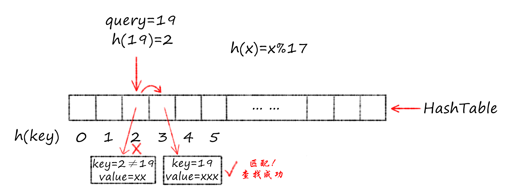

## 哈希的概念和目的

数组可以根据索引（下标）以O(1)的时间复杂度对元素进行随机存取。哈希查找希望根据给定的`关键词(key)`，在平均O(1)的时间下访问关键词对应的`值(value)`。

为了在计算机中实现哈希查找，我们需要借助数组以达到O(1)的时间复杂度。因此就需要将key映射到数组索引（下标）。这种映射关系称为`哈希函数`。哈希函数是key到数组索引的映射。

考虑存储空间的效率问题，我们希望key到索引的映射关系是"一一对应"的（单射且满射），即每个key都映射到唯一的索引。但这种哈希函数是很难找到的：

+ 实际情况中的key是各式各样的：数字，字符串，甚至对象都有可能。
+ 由于key的多样性，哈希函数可能将不同的key映射到同一个索引。因此哈希函数必然要面对并解决映射`冲突`问题。

例如`除留取余法`构建的的哈希函数：
$$
h(key) = key \hspace{1mm} mod \hspace{1mm} 17 \tag{1}
$$
对于key=2和key=19，他们均映射到同样的索引2。存储这两个key对应的value时就要解决"冲突"问题。解决冲突问题的方法有很多，例如开放寻址法、拉链法、二次散列法等。

假设我们用`线性探测法`解决冲突了问题。`线性探测法`是说：对于冲突的key，我们循环试探冲突位置的下一个位置，直到不冲突为止。例如(1)式的哈希函数，对于key的集合{2, 18, 36, 19, 55}，其哈希值为：

| key | 2 | 18 | 39 | 19 | 55 |
| :-: | :-: | :-: | :-: | :-: | :-: |
| 冲突处理前h(key) | 2 | 1 | 5 | 2 | 4 |
| 冲突处理后index = h(key) | 2 | 1 | 5 |  3  | 4 |

注意，我们是先对key=2求哈希值，并将其对应的value存储在数组索引为2的空间。而后到来的key=19求哈希也为2，发生冲突，于是根据线性探测法，在index = 3的位置探测到空闲空间并存储对应的value。

接下来问题来了：后续使用key=19查找时，存储时是否发生冲突对于后续查找来说是透明的。也就是说在查找时我们并不知道存储过程中是否发生了冲突。

这个问题原因在于信息不对称，因此将这个缺失的信息补上，问题就解决了：我们在存储时显式建立一张表（由于哈希值是数组索引，因此这张表实际上就是一个数组），这张表记录所有key到冲突处理后的h(key)的映射，也就是上面那张表的第一行和第三行。这张表称为`哈希表(Hash Table)`。在查找时，首先根据关键词query计算哈希值h(query)，然后比对表中索引为h(query)记录的key是否与query匹配，如果匹配，则查找成功，直接返回h(query)位置的value。如果不匹配，则说明存储时发生了冲突。那么按照存储时的冲突处理规则循环探测下一个位置，直到记录的key与query匹配（查找成功）或探测到空（关键词query在哈希表中不存在，查找失败）为止。

哈希查找过程示例：

## 哈希查找的过程

将上面的问题和解决方法做个总结，俯瞰整个哈希查找的过程：

+ 哈希表和哈希存储的建立过程：  
step1. 确定合适的哈希函数。  
step2. 对给定的key，计算哈希值h(key)。如有冲突，根据冲突处理方法处理。存储上述key和计算得到的h(key)，建立`哈希表`。注意，哈希函数计算出的`哈希值`就是数组`索引`。  
step3. 依据哈希表的对应关系，key对应的value存储在一个新数组（称为value数组）索引为h(key)的位置。

+ 哈希查找的过程：  
step1. 根据哈希函数计算query对应的哈希值h(query)。  
step2. 判断哈希表索引index = h(query)的元素值是否为query(key值匹配)，即判断hashTable[h(query)] == query是否为真。若真，匹配成功，取出value数组h(query)位置的元素并返回。
