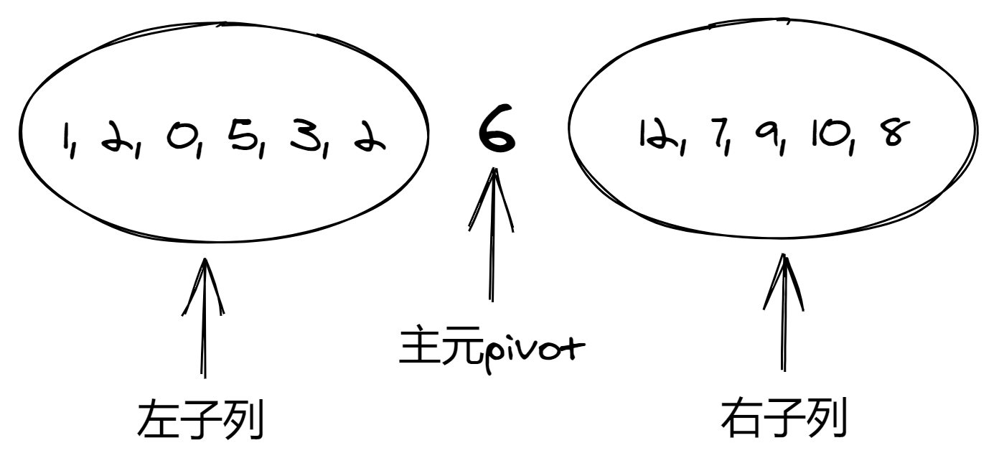
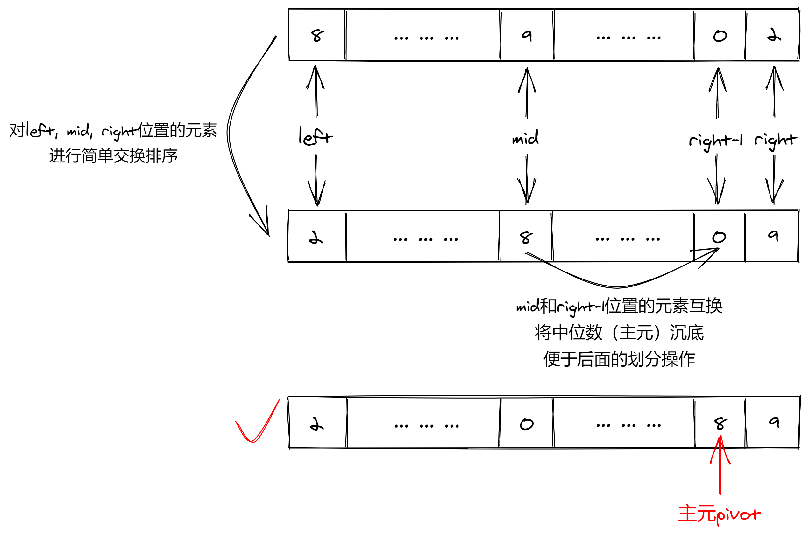
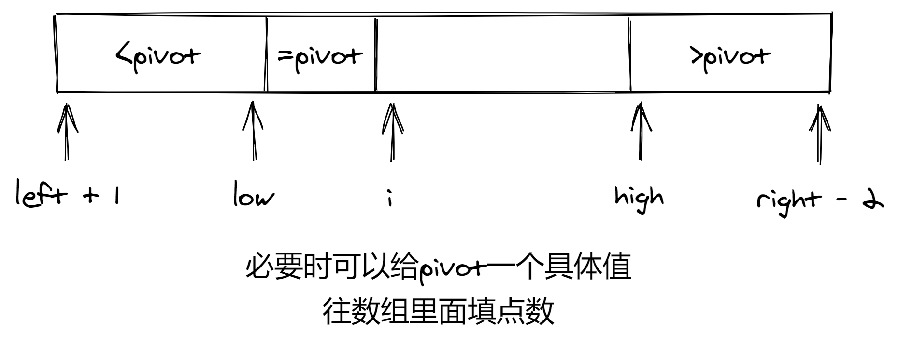

### 排序算法（升序）

1. 快速排序

   快排是一个非常细致的算法。在基于比较的排序算法中，快排确实在几乎所有情况下都是最快的，但前提是整个快排的实现过程是正确的。如果实现时稍微不小心，快排的效率将会非常低下，甚至出现运行问题，直接导致排序错误。

   从整体来看，快排分为三部分：

   + 选择主元pivot（部分资料中直译为枢轴量）
   + 递归主体
   + 外部接口（API）

   在部分资料中，递归主体中的主要操作之一：划分（partition），也被单独提出来作为一个部分：

   + 选择主元pivot（部分资料中直译为枢轴量）
   + 划分（partition）
   + 递归主体
   + 外部接口（API）

   这样整个快排就分成了四个部分。本节中，我们按照三部分的方式来解析。快排的整体声明：

   ``` c++
   class QuickSort{
        int median3(vector<int>& sequence, int left, int right);    // 中位数pivot
        int randSelect(vector<int>& sequence, int left, int right);    // 随机选择pivot
        void quickSort(vector<int>& sequence, int left, int right);    // 递归主体
        void quickSort(vector<int>& sequence);    // API
        void swap(int& a, int& b){
            int temp = a;
            a = b;
            b = temp;
        }
    };
   ```

   快排的基本思想：每次在序列中选定一个数字作为主元pivot，将序列划分（partition）为左右两个部分：左侧的所有元素比pivot小，右侧的所有元素比pivot大，等于pivot的元素可左可右（最好均匀分散在左右两侧）。接下来，递归地分别处理左右两侧的子序列。
   

   1. 主元pivot的选择  
       主元选择策略的好坏是影响排序算法的第一个重要因素。一个简单的方法是选择当前未排序序列的第一个元素作为主元，但这种策略是非常差的。考虑序列为逆序的情况：{9, 8, 7, 6, 5, 4, 3, 2, 1, 0}。第一次主元选择为9，剩余元素均小于9，通过交换将序列划分为{0, 8, 7, 6, 5, 4, 3, 2, 1, 9}。然后对左子列{0, 8, 7, 6, 5, 4, 3, 2, 1}排序，选择0为主元，所有元素又比0要大，于是又可以得到划分{0, 8, 7, 6, 5, 4, 3, 2, 1}。再对右子列{8, 7, 6, 5, 4, 3, 2, 1}排序。以此类推，可以发现，每次选定的主元要么比序列的其余元素都大，要么都小。也就是说，划分的左右侧子列，总有一侧是空的。如果这样递归下去，递归树是完全偏向一侧的：  
       .png)  
       一种比较合理的选择方式是随机选择。很多资料，包括leetcode912上的前排题解给出的快排都采用随机选择的方法，但生成随机数其实相对费时。在c/c++中，内置的排序函数`sort()`使用introsort(内省排序)算法，该算法中的主要部分之一就是快排。快排部分使用一种称为`median of 3`的方法选择主元。经过线上测试，这种方法相对高效。  
       median of 3（简记为median3）的想法是：选择未排序序列的首（left）、尾（right）、中间位置（mid）三个元素的中位数作为主元。为了便于后续的划分操作，我们额外对这三个元素进行简单的交换排序，使这三个元素相对升序排列，然后再将排序后mid位置的元素（也就是中位数，选定的主元）与right-1位置的元素互换。这样做之后，left, right-1, right三个位置的元素就相对有序，后续需要进行划分的区间就定在了[left+1, right-2]这个位置连续的范围上：
       
       实现参考代码：

       ``` c++
       int QuickSort::median3(vector<int>& sequence, int left, int right){
            /* 三个数的中位数作为pivot, 做三件事：
                1. 由首尾定中间mid = (left + right) / 2。
                2. 首、尾、中三个位置的元素升序/降序(视任务需要)排序。排序后mid位置元素即为中位数。
                3. mid与right-1位置的元素交换。返回right-1位置的元素作为pivot。
                容易坑的地儿：
                比较排序的顺序不能乱：先是left位置的元素与mid和right位置的元素分别比较和交换，
                使left位置元素最小，然后mid和right再比较和交换，以完成排序任务。
            */
            int mid = (left + right) >> 1;
            if(sequence[left] > sequence[mid]) swap(sequence[left], sequence[mid]);
            if(sequence[left] > sequence[right]) swap(sequence[left], sequence[right]);
            if(sequence[mid] > sequence[right]) swap(sequence[mid], sequence[right]);
            swap(sequence[mid], sequence[right-1]);
            return sequence[right-1];
        }
       ```

   2. 递归主体
        定好主元后，接下来就要将整个待排序列划分为大于pivot和小于pivot的两部分。由median3知，遍历的位置范围是[left+1, right-2]。具体做法可以有三种：
        1. 只考虑大于或小于pivot的元素。例如：用一个指针遍历位置在[left+1, right-2]范围内的元素，另一个指针指向小于pivot部分的末端。每查到一个小于pivot的元素就交换到小于pivot部分的尾部。
        2. （双路快排）设定两个指针，左指针low指向小于pivot部分的末尾，右指针指向大于pivot部分的头部。初始时low=left+1，high=right-2。遍历时两指针对撞，low碰到大于pivot的元素暂停，high碰到小于pivot的元素暂停。两指针都暂停时交换两指针指向的元素。直到low>high停止。此方法实现的快排常称为双路快排。
        3. （三路快排）使用三个指针：low指针指向小于pivot部分的末端，high指针指向大于pivot部分的头部，额外用第三个指针i进行遍历，遇到大于或小于pivot的元素就交换到对应的部分，遇到等于pivot的元素不进行任何处理。遍历完成后，序列就被分为大于pivot，小于pivot，等于pivot三个部分。此方法实现的快排常称为三路快排。

        这个部分比较容易出错的点：
        1. 指针何时向前/向后移动，以及何时循环终止。这里比较好的思考方式就是定区间，必要时举一般性的简单示例，然后画图。例如思考三路快排的示意图可以是这样的：
          
        2. 非常非常细的值得注意的点：操作导致的冗余的逻辑判断。如果代码中某些操作的冗余或缺失（缺失比较常见），导致了冗余的逻辑判断，将有可能导致边界情况的错误（下面参考实现的代码中，大段的注释举例说明了这个问题）。

        划分完成后，接下来递归处理左子列和右子列就可以了。

        到这里还有一件事：随着递归的进行，子列长度越来越小，也越来越趋于有序。对于基本有序的短序列，直接使用插排是非常快且高效的。因此我们设定一个阈值（超）参数cutoff，当待排序列小于cutoff时，直接使用插排。

        综上，双路快排的实现参考代码：

        ``` c++
        void QuickSort::quickSort(vector<int>& sequence, int left, int right){
            /* 三件事：
                1. 选主元pivot。
                2. 调整数组，分为两部分，左边比主元小，右边比主元大(通过交换来完成)。
                3. 调整完成后pivot换到合适的位置。
                额外的工作：
                当数组长度较小的时候，用简单排序。一方面可以大幅度降低递归深度节省内存，
                另一方面，递归到较短数组时，较短数组实际上基本有序，用简单排序算法非常快。
                快排是一个非常细致的算法，稍不注意，算法就会非常低效甚至出错。
                碰到的坑：（代码中可能出问题的地方以Qx注释）
                Q1: 选主元pivot的方法有很多种，常用的有中位数和随机选择法。
                中位数法(gcc sort函数的实现方法)：
                    一般用首尾+序列中心三个位置的元素查找中位数。实际上是进行三个数的比较排序。
                    排序的比较不能乱来，详见median3函数。
                Q2.x: 这是非常坑的一个问题！
                    如果Q2.1~Q2.4所标注的几句话变为这样：
                    low = left + 1;									// Q2.1m
                    high = right - 2;							  // Q2.2m
                    while(sequence[low] < pivot) low++;		// Q2.3m
                    while(sequence[high] > pivot) high--;	// Q2.4m
                    逻辑上似乎没什么问题，但实际上有两个严重的缺陷：
                    1. Q2.3m和Q2.4m所在的外层循环体完整执行一次后，
                        low和high位置的元素已经交换到了他们合适的位置。
                        下一次循环中，Q2.3和Q2.4进行的第一次比较是多余的。
                        (因为此时low和high位置的元素必然分别小于和大于主元pivot)。
                    2. 如果仅仅是一次比较的多余似乎不会造成问题，但考虑待排序列：
                        {1, 1, 1, 1, 1, 1, 1, 1, 1, 1, 1}
                        显然主元是1。如果按Q2.3m和Q2.4m的做法，low和high位置的元素始终等于pivot，
                        Q2.3m和Q2.4m的循环永远不会执行！这样low和high始终原地踏步，
                        外层循环终止条件Q2.5永远达不到。死循环！
                    综上所述，警惕处理和判断逻辑重叠导致的多余判断，很有可能造成极端输入情况下程序崩溃或是bug。
                    一个头一个尾，这是典型的双指针对撞法。
                    实际上还有另一种思路，一个指针i从left+1扫到right-2，
                    另一个指针j始终指向小于pivot的子序列的尾部。扫的时候把小的往前放，大的不管。
                    这样小于pivot的都跑到左边了，大于pivot的自然都在右边，
                    最后交换right-1和j位置的元素交换即可。
                Q3: 这种median3的方法必须使用cutoff，且cutoff必须大于2。
                    原因是：如果只有两个元素待排，此情况下快排的high指针在Q2.4操作时会越界！
                综上，算法的边界情况：
                    1. 数组中所有元素都是一个数。
                    2. 只有2个元素的数组。
            */
            int cutoff = 200, pivot, low, high;		// Q3
            if(right - left + 1 > cutoff){
                // 规模够大，快排
                pivot = median3(sequence, left, right);		// Q1
                low = left;		//Q2.1
                high = right - 1;	//Q2.2
                while(true){
                    while(sequence[++low] < pivot);		// Q2.3
                    while(sequence[--high] > pivot);	// Q2.4
                    if(low < high) swap(sequence[low], sequence[high]);		// Q2.5
                    else break;
                }
                swap(sequence[right-1], sequence[low]);
                quickSort(sequence, left, low - 1);
                quickSort(sequence, low + 1, right);
            }
            else{
                // 规模较小，简单排序。这里用直接插排
                for(int i = left + 1; i <= right; i++){
                    int j = i;
                    int temp = sequence[i];
                    while(j > 0 && sequence[j - 1] > temp){
                        sequence[j] = sequence[j-1];
                        j--;
                    }
                    sequence[j] = temp;
                }
            }
        }
        ```

   3. 外部接口
        对于排序算法来说，用户直接使用的接口其实只有一个或两个参数：数组的引用(vector\<int\>& seq)或数组指针+数组长度(int\[\] seq, int length)。递归主体函数有多个参数，对使用者来说不够友好，因此再封装一次即可：

        ``` c++
        void QuickSort::quickSort(vector<int>& sequence){
            quickSort(sequence, 0, sequence.size() - 1);
        }
        ```

    到此为止，一个良好性能的快排所需考虑的所有问题就都覆盖了。

2. 归并排序
