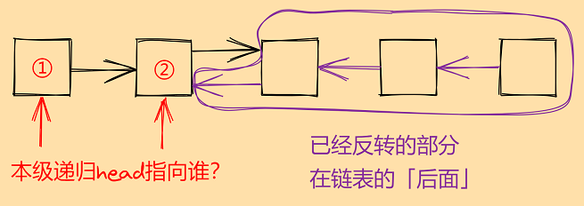

## 写在前面最重要的碎碎念

不夸张地说，「数据结构和算法」就和高考一样，实际应用题目至少有60%是吃经验的，而剩下40%对理论的「融会贯通」则是在获取60%经验的过程中逐渐得到的。因此，能完整用递归方法正确解题不是一蹴而就的。从模仿开始，多做多练多总结，是熟练掌握递归和其他算法的最快也是必经之路。

## 什么情况下可以考虑递归？

这是非常重要的前提：

1. 大问题 = 规模更小的小问题 + 一步处理。
2. 大问题和小问题的解决方法相同。

1，2构成状态转移，是递归最重要也是最吃经验的部分。问题具备这两个性质才可以用递归。

## 递归的三个要素

1. 一步递归操作（状态转移）
2. 返回值（可以是void）
3. 递归终止条件

## 前提条件

首先必须要说，递归不是目的，而是解决问题的一种方法。随着做题和练习，很容易陷入不分析问题而无脑递归的情况，尤其是「树」相关的题目（几乎所有二叉树相关的题目的第一个想法就是递归）。

正确的做法是：无论碰到什么题目，先分析问题。如果问题满足递归的前提，存在状态转移，那么就可以考虑使用递归解决。

确定问题具备递归解决的条件后，我们必须直面最大的问题：状态转移。这是一个非常吃经验和问题理解的部分，除了多做多练多总结，没有更快的方法（不如说猛刷然后总结是最快的）。在递归三要素中，除了状态转移，还有返回值和递归终止条件。如果没有一个合适的思考框架，我们很容易在三要素中绕进去。幸运的是，我们有一些降低整体递归难度的思考方法。

## 递归三部曲

一般来说，我们可以通过分析具体问题的「语义」来快速确定三要素中的一些要素，例如返回值或递归终止条件。于是一个可行的写递归的方法是：

1. 定义函数功能，给出函数接口，而不管具体实现。这一步根据问题的「语义」宏观地确定函数的输入参数和返回值。根据问题需要，有时可能还需要调整「状态」。
2. 确定大问题和小问题的关系（状态转移）和函数体内其他的操作。这一步思考过程中可能发现需要一些上层递归的信息，迭代更新step.1的函数接口即可。
3. 补充递归终止条件：边界情况和base情况的处理。

## 分析思路和方法

根据递归执行的过程，以递归调用为分界线，可将函数体内的语句分成三部分：

``` c++
ReturnedType f(args){
	some operations;    ←「递」送时执行
	递归调用f();
	some operations;    ←「归」来时执行
	return some_value;
}
```

按照这种划分，我们对于一步递归操作的思考可以更加细致：

1. 递归调用前的部分在「递」送时执行：转移到下一级递归前，本级要做什么？是否有信息需要传给下一层递归？函数参数传递。
2. 递归调用后的部分在「归」来时执行。这里有非常重要的一点：下一层递归结束后返回本层递归，意味着规模更小的子问题已经解决。也就是说，**返回到本级递归时，已经处理好的部分在「后面」。**这一点是我们整个思考和解决问题的关键之一。

举两个例子来理解：

+ 例1：二叉树的分治法（后序遍历）
	有些题目是二叉树后续遍历的变形，对于问题理解和分析（经验）要求比较高。之所以特别说后序遍历是分治法，是因为后续遍历确实是严格的先「分」后「治」。

	``` c++
	void postOrderTraversal(TreeNode* root){
		if(root){
			postOrderTraversal(root -> left);		←「分」，递归调用
			postOrderTraversal(root -> right);	   ←「分」，递归调用
			someOperations(root);					  ←「治」，「归」时执行
		}
	}
	```

	这种分治法的特点是：递归调用前没有操作，递归调用后进行操作。也就是说，整个「递」的过程只是分解而不处理问题（分而不治）。「归」来的过程中问题才真正被处理。因此这更要求我们考虑一步递归操作时，**将「后面」视作已经处理完的部分**。

+ 例2：反转单链表
	为了更好理解例1和之前的说法，做一题：递归反转单链表。
	反转单链表的递归解法真的是骚到没朋友，开始接触这道题的时候多数人看得懂题解却理解不了思路（为什么会想出这样的方法）。实际上是分治法铺垫在前。按照上面的思路和递归三部曲，一个完整的思考过程可能是这样的：

    1. API和返回值：反转以head为起始结点的单链表，返回反转后的链表的第一个结点。函数接口为`Node* ReverseLinkedList(Node* head)`。
    2. 函数体内的操作：
		1. 大问题分解为小问题（状态转移雏形）：  
			大问题：反转以head为起始结点为起始的单链表。
			小问题：反转以head -> next为起始结点为起始的单链表。
			大问题和小问题同法可解。那么初步的状态转移方程就是`ReverseLinkedList(head) = ReverseLinkedList(head) + 一步递归操作`
		2. 一步递归操作：根据前面的分析，考虑一级递归时，**「后面」应视作已经处理完成的部分**。看下图：

			

			这里遇到最关键的问题：本级递归head指向谁？对谁反转？这时我们跳出递归这件事，问自己一个问题：如果现在反转的链表就长上图这样，下一步应该反转操作如何进行？这个问题显而易见，我们应该握着①结点的指针，去反转②。那么自然，本级递归的head应该指向①，一步操作就是反转②。即：

			``` c++
			head -> next -> next = nullptr;
			```

		综合以上分析，函数体的伪代码描述为：

		``` c++
		// head == ①
		reversed_head = ReverseLinkedList(head -> next)		// 递归调用，函数始终返回已经反转好的链表的头结点，即原链表的尾结点。
		head -> next -> next = head;
		head -> next = nullptr;
		return reversed_head;		// 返回已经反转好的链表的头结点，即原链表的尾结点。
		```
		
		这里有两个非常tricky的点：
      		1. 由于我们最终是要得到已经反转好的链表的首结点，即**原链表的尾结点**，因此函数体内需要保存首结点，然后返回（上面伪代码中的reversed_head）。
      		2. head -> next置空，这是为了保证最后一个结点（也就是原链表的首结点）置空。细心的同学会发现这与之前分析过程中画的图稍有出入。这是由于我们之前尚不知已经反转的部分的细节情况，但大方向和链表的整体状态是没有问题的。这侧面说明，一个完整递归的构成是先确定大框架、大思路，然后在思考的过程中验证之前设定的逻辑（例如上面画图分析中的「已反转部分」），修正存在的问题，使递归的逻辑能够自洽。

    3. 最后一个问题：递归终点
		「递」时head逐级向后，由于我们需要返回已经反转好的链表的头结点，为了保证与上面的逻辑自洽，到达尾结点时直接返回之。需要注意的是，我们还要处理一下空链表这种极端的边界情况。不难想到，这个处理逻辑可以并入终止条件中：

		``` c++
		if(head == nullptr || head -> next == nullptr)
			return head;
		```

	将上面的分析和伪代码进行综合，完整的代码：

	``` c++
	Node* ReverseLinkedList(Node* head){
		if(head == nullptr || head -> next == nullptr)
			return head;
		// 递归调用，函数始终返回已经反转好的链表的头结点，即原链表的尾结点。
		Node* reversed_head = ReverseLinkedList(head -> next)
		head -> next -> next = head;
		head -> next = nullptr;
		return reversed_head;		// 返回已经反转好的链表的头结点，即原链表的尾结点。
	}
	```

## 问题类型和经验主义

递归作为一种方法，处理的问题非常多变。状态转移的得出非常依赖经验，因此多做题多练习是必要的。就个人经验来说，目前遇到的有几类问题：

1. 有一类问题的递归过程不需要返回值，而是在「递」的过程中动态更新一些全局变量，最终的结果保存在这些全局变量中。大多数这类问题中，「递」占逻辑的绝大部分，「归」可能不进行什么处理操作。相关题目：[662. 二叉树最大宽度][662]。
2. 在本层递归中需要上层递归的结果，因此需要将上层递归的结果作为函数参数进行传递。相关题目：[988. 从叶节点开始的最小字符串][988]，[129. 求根到叶子节点数字之和][129]。

有一些相对较难的问题：

1. 原问题较复杂，需要我们将问题分解为若干相对简单的问题，或是需要将问题转化为另一个与之相关的问题上。解决这些简单或是相关问题的方法是递归。相关题目：[写作easy读作medium的687. 最长同值路径][687]，[确实是hard的124. 二叉树中的最大路径和][124]。
2. 分治法，那种递归非常靠前的分治法。这要求我们对状态转移和返回值要考虑的非常清楚，先「分」（递）后「治」（归）。这类题是极具递归风格的题目，相对来说比较硬，是最吃经验和对题目理解的一类。相关题目：[写作easy读作medium的687. 最长同值路径][687]，[确实是hard的124. 二叉树中的最大路径和][124]。

总的来说，上面的思考目的是为初入递归的同学缕清思路，提供一种递归的入手方式，并明确递归究竟是难在哪儿。用递归处理问题是一条经验之路，本质上与高考别无二致。找好思考方式和自己习惯的入手角度后，多做多练，自己解不出来时多看高分题解，多总结状态转移方程，是最快将递归方法「内化」的方式。

[662]: ../leetcode/递归（树）/important-and-classical/M-662.二叉树最大宽度.md
[988]: ../leetcode/递归（树）/important-and-classical/M-988.从叶结点开始的最小字符串.md
[129]: ../leetcode/递归（树）/important-and-classical/M-129.求根到叶子节点数字之和.md
[687]: ../leetcode/递归（树）/Divide-and-Conquer/E(M)-687.最长同值路径.md
[124]: ../leetcode/递归（树）/Divide-and-Conquer/H-124.最大路径和.md
