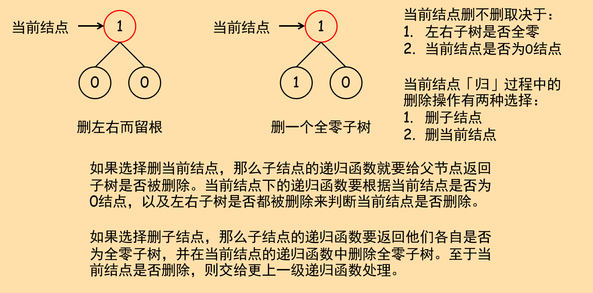

## 814. 二叉树剪枝

给定二叉树根结点`root`，此外树的每个结点的值要么是0，要么是1。返回移除了所有不包含1的子树的原二叉树。

注：结点`X`的子树为`X`本身，以及所有`X`的后代。

说明:

+ 给定的二叉树最多有 100 个节点。
+ 每个节点的值只会为 0 或 1 。

原题传送门：[https://leetcode-cn.com/problems/binary-tree-pruning](https://leetcode-cn.com/problems/binary-tree-pruning)

## 问题分析

本题是非常典型的适合递归解决的问题。搞清楚递归的两件事就能解决本题：递、归两个过程分别做什么？

根据题意，我们肯定要顺着根结点向下做DFS或BFS。若删除某个结点，则该结点的左右子树都是0结点，且该结点也为0结点。那么向下遍历（递）时，就要看当前结点是0结点还是1结点。向上返回（归）时，返回以当前结点为根结点的子树是否为全零子树。一定要画一个简单的示意图来辅助分析：



## 参考代码

法一，删子结点：返回左右子树是否含1结点，若当前结点的子树结点全零，则删当前结点的子结点而不删当前结点。

``` c++
class Solution {
public:
    bool dfs(TreeNode *root){
        // return if subTree has "1" node
        if(root == nullptr)
            return false;
        bool left_has_one = dfs(root -> left);
        bool right_has_one = dfs(root -> right);
        if(!left_has_one){
            delete root -> left;
            root -> left = nullptr;
        }
        if(!right_has_one){
            delete root -> right;
            root -> right = nullptr;
        }
        return root -> val == 1 || left_has_one || right_has_one;
    }
    TreeNode* pruneTree(TreeNode* root) {
        dfs(root);
        if(root -> val == 0 && !root -> left && !root -> right)
            return nullptr;
        return root;
    }
};
```

法二更直接，删当前结点。这样就要返回当前结点是否被删除，为父节点判断自己是否"自尽"提供必要信息。

``` c++
class Solution {
public:
    bool dfs(TreeNode *root){
        // return if deleted of this level
        if(root == nullptr)
            return true;
        bool left_del = dfs(root -> left);
        bool right_del = dfs(root -> right);
        if(left_del)
            root -> left = nullptr;
        if(right_del)
            root -> right = nullptr;
        if(left_del && right_del && root -> val == 0){
            delete root;
            return true;
        }
        else
            return false;
    }
    TreeNode* pruneTree(TreeNode* root) {
        dfs(root);
        return root;
    }
};
```
