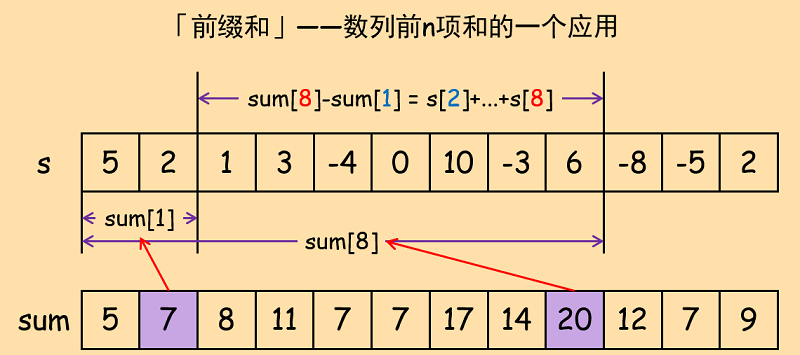

## 「前缀和」—— what and how

先给出一个基础版本的概念：

给定一个长为N的数列`seq`，我们开辟一个与其等长的新数组`sum`，依次计算数组`seq`的前k项和（即k从0遍历到N）并将结果存储在`sum[k]`中。若$0 \leq i \lt j \leq N-1$，那么借助`sum[i]`和`sum[j]`就可以计算数列`seq`从$i+1$到$j$的「中间和」：

$$ \sum_{k=i+1}^{j}{seq[k]} = seq[i+1] + seq[i+2] + ... + seq[j] = sum[j] - sum[i] \tag{1}
$$

对于`sum[j]`来说，`sum[i]`就是「中间和」$\sum_{k=i+1}^{j}{seq[k]}$的「前缀和」。

有一类特殊情况：位置$i$和位置$j$的「状态」相同，则数列从$i + 1$到$j$的「中间和」为零。

在上述基础版的概念上，根据具体问题的性质，我们可以将「求和」运算推广到一般运算上。例如「异或前缀和」使用异或运算进行状态的累积。

## 「前缀和」与动态规划的关系

「前缀和」方法其实是一种特殊的动态规划。这种动态规划的「状态」是数组「前$i$项和」的结果，其中$i$为当前遍历位置，并且利用公式$(1)$而不是直接利用状态转移方程对问题求解。这种将「累和」作为「状态」的方式，本质上是对「历史信息」的「积累」，而公式$(1)$则是一种利用「状态」（即「累计信息」）解决问题的一种特殊方式。

## Get Started

560\. 和为k的数组  
1371\. 每个元音包含偶数次的最长子字符串（异或前缀和）  
523\. 连续的子数组和（将「中间和」变形）

## More Exercise

308
525
1139
1176
1182
1277
1292
1314
1504
