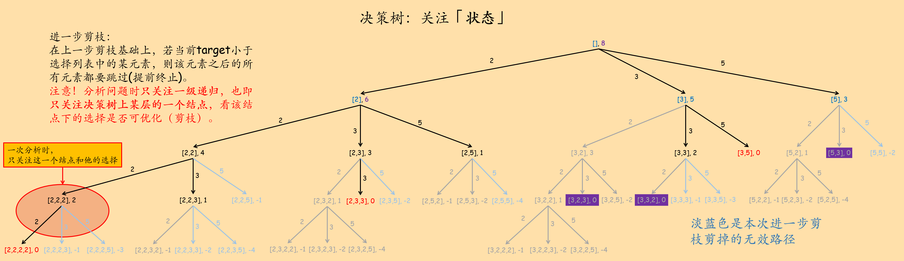

## 39. 组合总和

给定一个无重复元素的数组`candidates`和一个目标数`target`，找出`candidates`中所有可以使数字和为`target`的组合。`candidates`中的数字可以无限制重复被选取。

说明：

+ 所有数字（包括 target）都是正整数。
+ 解集不能包含重复的组合。

示例1：

``` text
输入：candidates = [2,3,6,7], target = 7,
所求解集为：
[
  [7],
  [2,2,3]
]
```

示例 2：

``` text
输入：candidates = [2,3,5], target = 8,
所求解集为：
[
  [2,2,2,2],
  [2,3,3],
  [3,5]
]
```

提示：

+ 1 <= candidates.length <= 30
+ 1 <= candidates\[i\] <= 200
+ `candidates`中的每个元素都是独一无二的。
+ 1 <= target <= 500

原题传送门：[https://leetcode-cn.com/problems/combination-sum](https://leetcode-cn.com/problems/combination-sum)

## 本题重点和值得学习的方法

1. 两种回溯法的构成：关注「状态」和关注「选择」。
2. 整道题的思路：关注「状态」的方法上手，然后逐步剪枝。
3. 决策树的剪枝。

## 决策树与两种回溯法

### 关注「状态」的方法

我们先来看关注「状态」的方法。以数组`candidates = [2, 3, 5]`，目标和`target = 8`为例，不难画出决策树：


所谓「关注状态」是指：我们利用「状态」信息来判断是否满足递归终止条件。

不难看出这个决策树的问题：重复解，且有很重的冗余。但这是我们「剪枝」优化的起点。

在画出这个递归树的过程中其实就能看出一些问题：

1. 太多可以提前终止的分支：我们举的这个例子中的数组是有序的，利用这个性质，我们可以在当前选择的值`candidates[i]`大于当前目标值`target`的时候提前终止遍历。本题所给数组`candidates`不一定有序，那么我们可以先对其排序，再进行决策树的DFS。
2. 重复解的问题。例如\[3, 5\]和\[5, 3\]就是一组重复解。根据遍历的先后顺序，\[3, 5\]是先于\[5, 3\]得到的，因此\[5, 3\]是应该剪掉的一个重复解。造成这组重复解的原因是：第一个候选值5被选择后，我们就不应该再选择比5小的候选值了。同理，\[2, 3, 3\], \[3, 2, 3\], \[3, 3, 2\]这三个重复解中，\[2, 3, 3\]是先遍历到的，而\[3, 2, 3\], \[3, 3, 2\]都是在选择3后仍将小于3的2作为了候选值，而造成了重复解。概括来说就是：在某步中选择了某个候选值`x`后，之后选择的候选值应始终大于等于`x`。

根据这两条，我们就可以剪掉很多分支了：


可以看出剪去了将近一半的分支，说明原始的决策树冗余是很重的。

参考代码：

``` c++
class Solution {
private:
    vector<vector<int>> result;
    void solver(vector<int> &choice_list, vector<int> &cur_result, int start, int target){
		/* choice_list为选择列表，start指针配合choice_list用于剪枝。*/
        if(target < 0){
			// 终止条件1：当前目标和为负，当前选择路径不可行，直接终止递归
			return;
		}
        if(target == 0){
			// 终止条件2：当前目标和恰好为零，当前选择路径是一个解，push进最终结果中
            result.push_back(cur_result);
            return;
        }
		// 当前选择路径尚不完全，进行下一步选择
        for(int i = start; i < choice_list.size(); i++){
			// 从start开始，下标小于start的元素都比上一步选择的元素小，这些元素不能选
            cur_result.push_back(choice_list[i]);	// 更新状态
            solver(choice_list, cur_result, i, target - choice_list[i]);	// 进入下一轮递归。下轮递归的选择列表要排除下标小于i的元素，即start = i
            cur_result.pop_back();		// 撤销选择
        }
    }
public:
    vector<vector<int>> combinationSum(vector<int>& candidates, int target) {
        vector<int> cur_result;
        sort(candidates.begin(), candidates.end());		// 排序，便于剪枝
        solver(candidates, cur_result, 0, target);
        return result;
    }
};
```

### 进一步剪枝：过渡到关注「选择」的方法

接下来，我们看看在**一级**之中做的每个「选择」是否会满足一些使递归提前终止的条件。注意！分析问题时一次**只关注一级递归**，也即**只关注决策树上某层的某一个结点**，看该结点下的选择是否可优化。我们可能进行多次这样的分析，从而找到并抽象出所有可能的优化条件（剪枝条件）。切忌连着多级看，否则思路极有可能被打乱并导致错误。

在上一步剪枝后，其实还有一些分支可以进一步剪掉：若当前target小于选择列表中的某元素，那么该元素及该元素后面的元素全部都应该跳过。据此，可进一步剪枝：



参考代码：

``` c++
class Solution {
private:
    vector<vector<int>> result;
    void solver(vector<int> &choice_list, vector<int> &cur_result, int start, int target){
        // 终止条件1：当前状态是一个解
        if(target == 0){
            result.push_back(cur_result);
            return;
        }
        // 当前状态尚不能确定当前选择路径是否可行，进行下一次选择
        for(int i = start; i < choice_list.size(); i++){
            // 终止条件2(剪枝，提前终止)：当前target小于选择，后续元素都不必再看，提前终止
            if(target < choice_list[i]){
                return;
            }
            // 当前选择有可能是一个答案的一部分，继续向下寻找。
            cur_result.push_back(choice_list[i]);
            solver(choice_list, cur_result, i, target - choice_list[i]);
            cur_result.pop_back();
        }
    }
public:
    vector<vector<int>> combinationSum(vector<int>& candidates, int target) {
        vector<int> cur_result;
        sort(candidates.begin(), candidates.end());
        solver(candidates, cur_result, 0, target);
        return result;
    }
};
```

### 我还能剪！

也不难发现，当`target` == 当前选择`choice_list[i]`时，当前已进行的选择`cur_result`加上`choice_list[i]`就是一个解，且`choice_list[i]`后面的元素（`choice_list`中索引大于i的元素）可以直接pass。需要注意的是，将`choice_list[i]`push进`cur_result`并将`cur_result`push进最终结果后，需要再将`choice_list[i]`从`cur_result`中删除，恢复回当前状态。这是因为我们返回递归（也是决策树）的上一层时是以当前状态为基准，而将`choice_list[i]`push进`cur_result`的操作破坏了当前状态，因此需要进行恢复操作。


参考代码：

``` c++
class Solution {
private:
    vector<vector<int>> result;
    void solver(vector<int> &choice_list, vector<int> &cur_result, int start, int target){
        /* 终极剪枝后，这里的判断不再需要，因为根本不会进入target == 0的状态。
        if(target == 0){
            result.push_back(cur_result);
            return;
        }
        */
        // 当前状态尚不能确定当前选择路径是否可行，进行下一次选择
        for(int i = start; i < choice_list.size(); i++){
            /* 终极剪枝：这一次选择能够构成一个解，不再递归和循环，
				更新当前选择cur_result，push进最终结果中并返回上一层递归（决策树的上一层）。
				注意要恢复当前状态。
			*/
			if(target == choice_list[i]){
                cur_result.push_back(choice_list[i]);
                result.push_back(cur_result);
                cur_result.pop_back();		// 恢复状态
                return;
            }
            // 在当前选择下，看看是否满足条件或需要跳过当前选择
            if(target < choice_list[i]){
                // 当前target小于选择，后续元素都不必再看，提前终止
                return;
            }
            // 当前选择有可能是一个答案的一部分，继续向下寻找。
            cur_result.push_back(choice_list[i]);
            solver(choice_list, cur_result, i, target - choice_list[i]);
            cur_result.pop_back();
        }
    }
public:
    vector<vector<int>> combinationSum(vector<int>& candidates, int target) {
        vector<int> cur_result;
        sort(candidates.begin(), candidates.end());
        solver(candidates, cur_result, 0, target);
        return result;
    }
};
```

最后再来回顾一下本题的分析过程：


