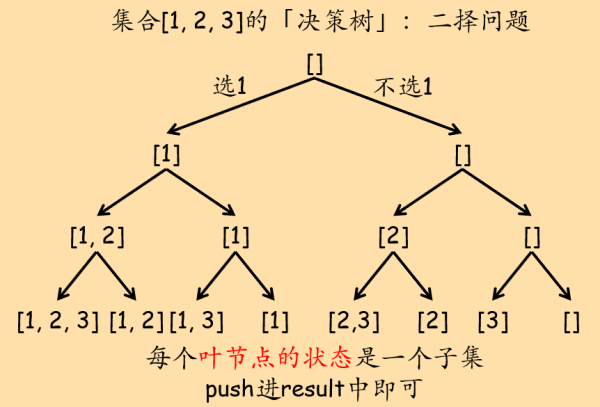
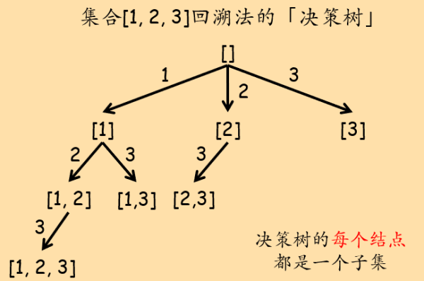

## 78. 子集

给定一组不含重复元素的整数数组 nums，返回该数组所有可能的子集（幂集）。

说明：最终结果不能包含重复的子集。子集间的顺序可以是任意的。

示例：

``` text
输入: nums = [1,2,3]
输出:
[ [3], [1], [2], [1,2,3], [1,3], [2,3], [1,2],[] ]
```

原题传送门：[https://leetcode-cn.com/problems/subsets](https://leetcode-cn.com/problems/subsets)

## 决策树

有两种可行的决策树：

1. 二叉决策树：当前剩余元素中的第一个元素，选还是不选 → 二叉决策树，二叉树的前序遍历（dfs）。

	这种方法的思路实际上是源于问题分解：对于数组中的第一个元素，两种情况：选和不选。无论选或不选，除去第一个元素，需对其余元素组成的集合同样求子集。最后问题的解 = `剩余元素的每个子集 concat 第一个元素` + `剩余元素的子集`。剩余元素的子集是一个同法可解的问题，递归求解即可。终止条件就是元素都遍历过了（所有元素都挑完了），这时候的子集是原集合的一个子集，push进结果即可。

	可以看出，这个思路本质上就是决策树。

	

2. 多叉决策树（回溯法）：当前剩余元素就是选择列表，选哪个？ → 多叉决策树，多叉树的前序遍历（dfs），即回溯法。

	

## 参考代码

### 二叉决策树下的dfs

``` c++
class Solution {
private:
    vector<vector<int>> result;
public:
    void solver(vector<int>& nums, int cur_ptr, vector<int>& cur_subset){
        if(cur_ptr == nums.size()){
            /* 递归到决策树的叶子结点，所有元素都进行了二择。
				此时，cur_subset是原集合的一个子集，push到最终结果中。*/
            result.push_back(cur_subset);
            return;
        }
		// 选第一个元素
        cur_subset.push_back(nums[cur_ptr]);
        solver(nums, cur_ptr + 1, cur_subset);
		// 不选第一个元素
        cur_subset.pop_back();
        solver(nums, cur_ptr + 1, cur_subset);
    }
    vector<vector<int>> subsets(vector<int>& nums) {
        vector<int> cur_subset;
        solver(nums, 0, cur_subset);
        return result;
    }
};
```

### 多叉决策树下的dfs（回溯法）

``` c++
class Solution {
private:
    vector<vector<int>> result;
public:
    void solver(vector<int>& nums, int start, vector<int>& cur_subset){
		/* 每层递归其实就是决策树上的一个结点。因此需要：
			1. 表示当前结点状态stage → cur_subset
			2. 表示选择列表choice_list。
				根据题目的选择策略，原始集合+左边界指针即可表示选择列表 → nums + start */
        result.push_back(cur_subset);
        for(int i = start; i < nums.size(); i++){
            cur_subset.push_back(nums[i]);
            solver(nums, i + 1, cur_subset);
            cur_subset.pop_back();
        }
    }
    vector<vector<int>> subsets(vector<int>& nums) {
        vector<int> cur_subset(0);
        solver(nums, 0, cur_subset);
        return result;
    }
};
```
