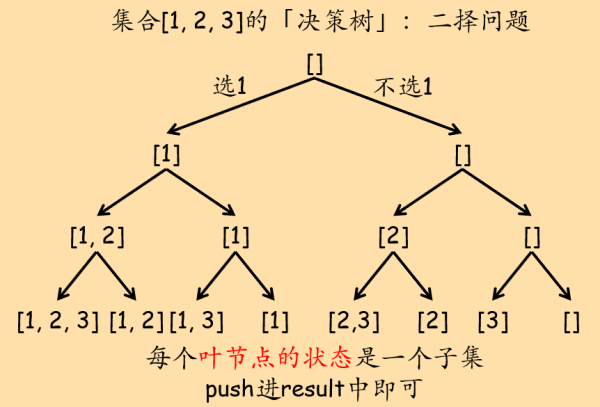
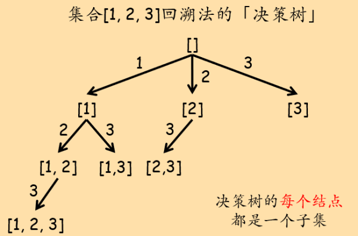

## 决策树

决策问题可以单独归为一类，这类问题一旦规模变大，可能的情况就会非常多，人工解起来就比较困难。而恰好计算机最擅长的工作之一就是暴力穷举。于是我们可以设定一些穷举策略，让计算机为我们遍历所有可能的情况。

「顺序决策」问题在逻辑上存在一个「决策树」，这个决策树可能是二叉的（0-1决策），也可能是多叉的。决策的一步对应决策树上的一个结点，我们进行每一步决策都有两个关键要素：当前`「状态」`和本步决策的所有可能的`「选择列表」`。如果用代码描述，决策树结点的ADT：

``` c++
template<typename State>
struct DecisionNode{
	State state;		// 当前位置（结点）的状态
	vector<DecisionNode*> choice_list;		// 当前位置（结点）的所有可能选择（选择列表）
};
```

我们通过「遍历」决策树来解决实际问题。实际中，「决策树」只是我们求解问题的一个逻辑结构，上述ADT的实例并不真实存储于内存中。为了使用当前「状态」和「选择列表」这两个信息进行决策，通常将他们作为递归函数的参数，并在递归过程中动态更新。很多情况下，根据问题本身的性质，还会将他们做一些「等价转化」以节省空间。

举个例子：在子集问题中（求给定集合的所有子集，leetcode 78题），有两种方案。一种方案是依次遍历每个元素，决定在子集中，选或不选该元素：



这种策略下的代码：

``` c++
class Solution {
private:
    vector<vector<int>> result;
public:
    void solver(vector<int>& nums, int cur_ptr, vector<int>& cur_subset){
        if(cur_ptr == nums.size()){
            /* 递归到决策树的叶子结点，所有元素都进行了二择。
				此时，cur_subset是原集合的一个子集，push到最终结果中。*/
            result.push_back(cur_subset);
            return;
        }
		// 选第一个元素
        cur_subset.push_back(nums[cur_ptr]);
        solver(nums, cur_ptr + 1, cur_subset);
		// 不选第一个元素
        cur_subset.pop_back();
        solver(nums, cur_ptr + 1, cur_subset);
    }
    vector<vector<int>> subsets(vector<int>& nums) {
        vector<int> cur_subset;
        solver(nums, 0, cur_subset);
        return result;
    }
};
```

另一种方案是，在每步决策中，考虑选哪个元素。这里要注意，在这种决策结构下，如果某步选择了某个元素`item`，那么以该步决策为基础的后续选择中，`item`前的所有元素都必须从选择列表中排除。例如集合\[1, 2, 3, 4, 5\]，如果第一步决策中选择了3，那么以这一步选择为基础的后续选择中，不能再选1和2。



在这种策略下的代码：

``` c++
class Solution {
private:
    vector<vector<int>> result;
public:
    void solver(vector<int>& nums, int start, vector<int>& cur_subset){
		/* 每层递归其实就是决策树上的一个结点。因此需要：
			1. 表示当前结点状态stage → cur_subset
			2. 表示选择列表choice_list。
				根据题目的选择策略，原始集合+左边界指针即可表示选择列表 → nums + start */
        result.push_back(cur_subset);
        for(int i = start; i < nums.size(); i++){
            cur_subset.push_back(nums[i]);
            solver(nums, i + 1, cur_subset);
            cur_subset.pop_back();
        }
    }
    vector<vector<int>> subsets(vector<int>& nums) {
        vector<int> cur_subset(0);
        solver(nums, 0, cur_subset);
        return result;
    }
};
```

## 一般形式的树（多叉树）的遍历

「决策」问题本质上就是遍历「树」。二叉决策树的遍历我们用二叉树递归即可，而所谓「回溯法」其实就是多叉树的遍历。实际上，「树」结构的一般形式是「多叉树」，二叉树只不过是一种用的比较多的特殊形式。从「决策树」的角度来看，由于二叉树的每个节点只有左右孩子两个子节点，因此「选择列表」也就只有两个元素，在编写代码时，显式访问他们即可：

``` c++
/* 设递归函数的函数头为BTreeTraversal(root) */
// 前序操作
BTreeTraversal(root -> left);
// 中序操作
BTreeTraversal(root -> right);
// 后序操作
```

而作为树的一般情况，多叉树的子节点数量可能不定。从决策树的角度：「选择列表」中的元素数量不定。那么使用for循环即可：

``` c++
/* 设递归函数的函数头为TreeTraversal(root) */
vector<TreeNode*>& child_list = root -> child_list;		// 子节点列表（选择列表）
for(int i = start; i < child_list.size(); i++){
	// 「前序」操作
	TreeTraversal(child_list[i]);
	// 「后序」操作
}
```

这也就是多叉树的遍历「模板」。

现在再来回看子集问题的两个方案和和他们的代码：二叉树遍历，回溯法，多叉树遍历这三者是通的。

## Get Started

46\. 全排列  
78\. 子集
