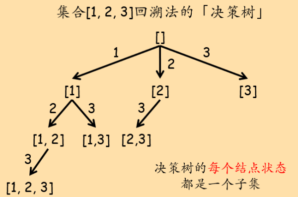

## 决策树

（待完成，参考labuladong的全排列，本质就是决策树。用语需要规范一下：「路径」→状态stage，「选择列表」是对的）

决策问题可以单独归为一类，这类问题一旦规模变大，可能的情况就会非常多，人工解起来就比较困难。而恰好计算机最擅长的工作就是暴力穷举。于是我们可以设定一些穷举策略，让计算机为我们遍历所有可能的情况。

「顺序决策」问题在逻辑上存在一个「决策树」，这个决策树可能是二叉的（0-1决策），也可能是多叉的。决策的一步对应决策树上的一个结点，我们进行每一步决策都有两个关键要素：当前「状态」和本步决策的所有可能的「选择列表」。举个例子：在列举给定集合的所有子集问题中，有两种方案。一种方案是依次遍历每个元素，决定在子集中，选或不选该元素：


另一种方案是，在每步决策中，考虑选哪个元素。这里要注意，在这种决策结构下，如果某步选择了某个元素`item`，那么以该步决策为基础的后续选择中，`item`前的所有元素都必须从选择列表中排除。例如集合\[1, 2, 3, 4, 5\]，如果第一步决策中选择了3，那么以这一步选择为基础的后续选择中，不能再选1和2。



如果用代码描述，决策树结点的ADT：

``` c++
template<typename State>
struct DecisionNode{
	State state;		// 当前位置（结点）的状态
	vector<DecisionNode*> choice_list;		// 当前位置（结点）的所有可能选择（选择列表）
};
```

我们通过在决策树上「游走」来解决实际问题。多数情况下，「游走」的具体形式就是「遍历」。而对于树的遍历，通常使用递归，每一步递归就对应着遍历到决策树上的一个结点。但「决策树」只是我们的一个逻辑结构，并不直接存储在内存中，因此我们需要在递归中用合适的方式表示「状态」和「选择列表」以进行决策。这二者一般使用函数参数来表示，并根据问题本身，会做一些「等价转化」以节省空间。

## 典型例题

46\. 全排列  
78\. 子集
