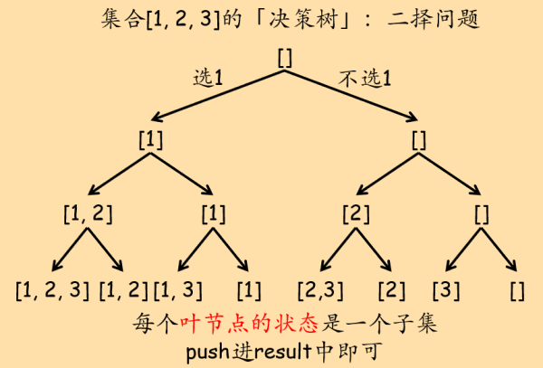

## 决策树

决策问题可以单独归为一类，这类问题一旦规模变大，可能的情况就会非常多，人工解起来就比较困难。而恰好计算机最擅长的工作之一就是暴力穷举。于是我们可以设定一些穷举策略，让计算机为我们遍历所有可能的情况。

「顺序决策」问题在逻辑上存在一个「决策树」，这个决策树可能是二叉的（0-1决策），也可能是多叉的。决策的一步对应决策树上的一个结点，我们进行每一步决策都有两个关键要素：当前`「状态」`和本步决策的所有可能的`「选择列表」`。如果用代码描述，决策树结点的ADT：

``` c++
template<typename State>
struct DecisionNode{
	State state;		// 当前位置（结点）的状态
	vector<DecisionNode*> choice_list;		// 当前位置（结点）的所有可能选择（选择列表）
};
```

我们通过「遍历」决策树来解决实际问题。实际中，「决策树」只是我们求解问题的一个逻辑结构，上述ADT的实例并不真实存储于内存中。为了使用当前「状态」和「选择列表」这两个信息进行决策，通常将他们作为递归函数的参数，并在递归过程中动态更新。很多情况下，根据问题本身的性质，还会将他们做一些「等价转化」以节省空间。

举个例子：在子集问题中（求给定集合的所有子集，leetcode 78题），有两种方案。一种方案是依次遍历每个元素，决定在子集中，选或不选该元素：



这种策略下的代码：

``` c++
class Solution {
private:
    vector<vector<int>> result;
public:
    void solver(vector<int>& nums, int cur_ptr, vector<int>& cur_subset){
        if(cur_ptr == nums.size()){
            /* 递归到决策树的叶子结点，所有元素都进行了二择。
				此时，cur_subset是原集合的一个子集，push到最终结果中。*/
            result.push_back(cur_subset);
            return;
        }
		// 选第一个元素
        cur_subset.push_back(nums[cur_ptr]);
        solver(nums, cur_ptr + 1, cur_subset);
		// 不选第一个元素
        cur_subset.pop_back();
        solver(nums, cur_ptr + 1, cur_subset);
    }
    vector<vector<int>> subsets(vector<int>& nums) {
        vector<int> cur_subset;
        solver(nums, 0, cur_subset);
        return result;
    }
};
```

另一种方案是，在每步决策中，考虑选哪个元素。这里要注意，在这种决策结构下，如果某步选择了某个元素`item`，那么以该步决策为基础的后续选择中，`item`前的所有元素都必须从选择列表中排除。例如集合\[1, 2, 3, 4, 5\]，如果第一步决策中选择了3，那么以这一步选择为基础的后续选择中，不能再选1和2。


在这种策略下的代码：

``` c++
class Solution {
private:
    vector<vector<int>> result;
public:
    void solver(vector<int>& nums, int start, vector<int>& cur_subset){
		/* 每层递归其实就是决策树上的一个结点。因此需要：
			1. 表示当前结点状态stage → cur_subset
			2. 表示选择列表choice_list。
				根据题目的选择策略，原始集合+左边界指针即可表示选择列表 → nums + start */
        result.push_back(cur_subset);
        for(int i = start; i < nums.size(); i++){
            cur_subset.push_back(nums[i]);      // 做选择，更新当前状态
            solver(nums, i + 1, cur_subset);     // 递归遍历决策树(DFS)
            cur_subset.pop_back();                 // 撤销选择
        }
    }
    vector<vector<int>> subsets(vector<int>& nums) {
        vector<int> cur_subset(0);
        solver(nums, 0, cur_subset);
        return result;
    }
};
```

## 回溯法

「回溯法」是处理「决策问题」的一种方法，其本质就是对多叉决策树进行DFS，就是多叉树的遍历。「回溯法」的核心是：状态不确定，就继续对决策树DFS。当状态满足了某些条件（例如找到一个解 or 当前的选择路径能够确定不合适），就做一些必要的操作（例如找到了一个解，那就将该解push到结果中）然后退回上一步（上层递归）。

## 第一种方式

1. **根据当前状态**判断是否满足问题终止条件。若满足，进行必要的操作后返回上一层递归。
2. 遍历选择列表，进行选择并更新状态，作为下一级递归的状态。
3. 对每次的选择，进行递归调用。
4. 撤销本次选择（「归」的过程）。

伪代码：

``` c++
// 当前状态
if 当前状态满足结束条件{
    一些必要的操作;
    return;
}
// 更新状态，作为下一级递归的状态。向下递归。
for choice in 选择列表{
    做选择，更新状态;
    递归调用，DFS决策树;
    撤销选择;
}
```

### 第二种方式

1. 每次在「选择列表」中进行一次选择。
2. **根据选择**判断这次选择是否满足问题的终止条件。若满足，向上一层递归返回，或进行下一次选择。
3. 更新当前状态。
4. 递归地对决策树DFS。
5. 撤销本次选择。

伪代码：

``` c++
for choice in 选择列表{
    if choice + 当前状态state使问题达到终止条件{
        一些必要的操作;
        「归」回上一层递归调用(return)
        or
        进行下一次选择(continue);
    }
    用choice更新当前状态state;
    递归调用，DFS决策树;
    撤销选择;
}
```

### 两种方式的区别和联系

+ 第一种方式是更纯粹的递归。每一步中，根据当前状态判断是否应该终止递归，在「做选择」这件事上则不进行任何合理性判断（例如提前判断当前选择是否合适）。这种方式**更着重关注「状态」**，根据「当前状态」来判断是否满足问题的递归结束条件。
+ 第二种方式是一步到位的思考：在必要的时候终止循环，返回上一步。同时关注于跳过某些不合适的选择。这种方式**更着重关注「选择」**，根据进行的选择来判断是否满足问题的递归结束条件。一般来说，这种方式的时间和空间相对较优，但一步到位的思路在实际操作上较难。

两种方式在本质上是一样的。经过实践检验，一个相对合适的思考策略是：从第一种方式入手，画出决策树，然后分析决策树中的冗余，通过「剪枝」等去冗余手段，可以自然得到第二种方式的较优解。经典的运用实例，可以参见39. 组合总和的[题解][组合总和题解]。

## Digression：多叉树的遍历

「决策」问题本质上就是遍历「树」。二叉决策树的遍历我们用二叉树递归即可，而所谓「回溯法」其实就是多叉树的遍历。实际上，**「树」结构的一般形式是「多叉树」**，二叉树只不过是一种用的比较多的特殊形式。从「决策树」的角度来看，由于二叉树的每个节点只有左右孩子两个子结点，因此「选择列表」也就只有两个元素，在编写代码时，显式访问他们即可：

``` c++
ReturnedType BTreeTraversal(root){
    // 前序操作
    BTreeTraversal(root -> left);
    // 中序操作
    BTreeTraversal(root -> right);
    // 后序操作
}
```

而作为树的一般情况，多叉树的子结点数量可能不定。从决策树的角度：「选择列表」中的元素数量不定。那么使用for循环即可：

``` c++
ReturnedType TreeTraversal(root){
    vector<TreeNode*>& child_list = root -> child_list;		// 子结点列表（选择列表）
    // 「当前结点」要做的「前序」操作
    for(int i = start; i < child_list.size(); i++){
        // 进入每个子结点前都要进行的「前序」操作
        TreeTraversal(child_list[i]);
        // 从每个子结点返回后都要进行的「后序」操作
    }
    // 当前结点的子结点全部遍历完成后，要进行的「后序」操作
}
```

这也就是多叉树的遍历「模板」。有一点特别值得注意：多叉树遍历的「前序」和「后序」操作分为循环内部和循环外部：循环内部的前、后序操作应该是在「每一个」子结点递归前后都要干的事。而循环外部的操作则是递归遍历所有子结点前和递归遍历所有子结点后的操作。从语义上来说，循环内部的前后序操作可能与每个子结点相关，而循环外部则可能与子结点无关（当然，这个说法并不严谨。希望能通过这一段，大家能够对多叉树遍历形成一些「感觉」和自己的理解）。

现在再来回看子集问题的两个方案和和他们的代码：二叉树遍历，回溯法，多叉树遍历这三者是通的。

## Get Started

46\. 全排列  
78\. 子集  
39\. 组合总和  
51\. N皇后（必做经典题！上面三道题做完后务必尝试该题。本题是隐式决策树，虽然标注难度为Hard，但实际并不难）  
698\. 划分为k个相等的子集（综合性强。涉及提前返回，剪枝，相对复杂的决策过程。虽然难度标注为Medium，但比标注为Hard的N皇后难。）

[组合总和题解]:./M-39.组合总和.md
