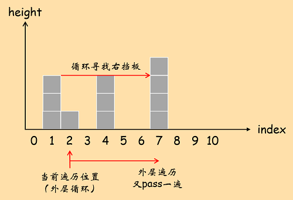
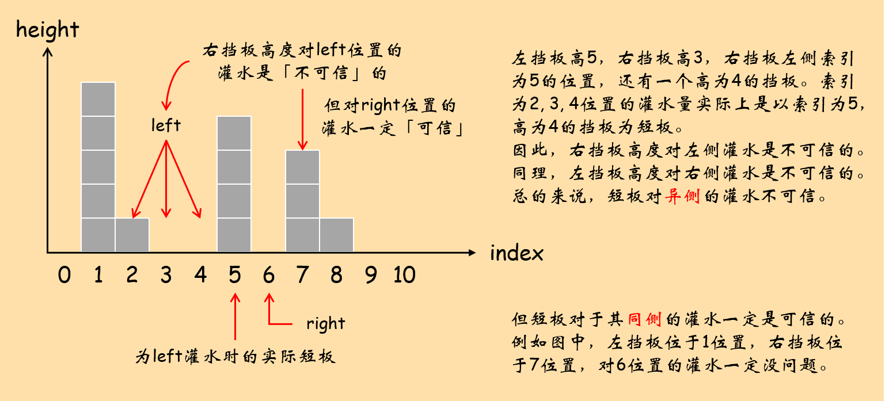

## 42. 接雨水

给定 n 个非负整数表示每个宽度为 1 的柱子的高度图，计算按此排列的柱子，下雨之后能接多少雨水。

**示例：**

``` text
输入: [0,1,0,2,1,0,1,3,2,1,2,1]
输出: 6
```

**示意图：**


上图对应的输入数组为：\[0, 1, 0, 3, 1, 0, 4, 0, 0, 3, 1\]。盛水部分的面积为蓝色部分，总面积为12。

原题传送门：[https://leetcode-cn.com/problems/trapping-rain-water](https://leetcode-cn.com/problems/trapping-rain-water)

## 本题最大的价值

本题虽难，但非常值得反复研习：

1. 强调对问题本身的分析。理解问题具备的性质后，可得出暴力解，并且暴力解是后续优化的基础。
2. 本题所采取的优化方法中，涵盖了「动态规划」，「双指针」以及「单调栈」。
3. 从暴力解到优化方法，思路一脉相承，展示了一个求解问题的完整的思考过程。

## 分析

### 问题分析与暴力解

设`height`为存储柱子（挡板）高度的数组。最容易想出的一个思路是：遍历数组，逐位置地向里面「灌水」，因此我们需要知道每个位置最多能灌进去多少水。对于索引为i的位置，根据「短板效应」，能灌进去的最大水量取决于：`shorter = min(i位置左侧最高挡板的高度, i位置右侧最高挡板的高度)`。即我们需要分别找到i位置左侧和右侧的最高挡板，取两个「最高挡板高度」的「最小值」为`shorter`，则i位置能接受的最大灌水量为`shorter - height[i]`，其中`height[i]`为i位置的柱高。

参考代码：

``` c++
// 待更新
```

时间复杂度：内层遍历寻找左右最高挡板需要$O(N)$，外层遍历是$O(N)$的复杂度。两层嵌套，总时间复杂度为$O(N^2)$。  
空间复杂度：$O(1)$。

暴力解是后续优化的基础。一般来说，如果我们无法直接想出一个最好的解决方案，那么一定先给出一个暴力解，然后逐步优化。暴力可解后，我们心里就有了底，后续的优化策略就不会有过高的思维门槛。

### 优化：遍历每次都找左右最高挡板是冗余的

遍历到某位置时，如果以该位置向左右遍历，找到了一组最高挡板，那么这组挡板间的所有位置都共享这组最高挡板，而不必在每个位置都向左右遍历。

参考代码：

``` c++
class Solution {
private:
    int max(int a, int b){
        return a>b?a:b;
    }
    int min(int a, int b){
        return a>b?b:a;
    }
public:
    int trap(vector<int>& height) {
        if(height.size() <= 2)
            return 0;
        int left_max_pos = 0;			// 左挡板
        int right_max_pos = 0;		   // 右挡板
        int left_max = height[0];
        int right_max = 0;
        int result = 0;
        for(int i = 1; i < height.size(); i++){
            if(i > right_max_pos){
				// 当前遍历位置超过右挡板：原先的右挡板变为左挡板，向右遍历找新的右挡板。
                right_max = 0;
                right_max_pos = 0;
                left_max = height[i - 1];
                left_max_pos = i - 1;
                for(int j = i + 1; j < height.size(); j++){
                    if(height[j] > right_max){
                        right_max = height[j];
                        right_max_pos = j;
                    }
                }
            }
            if(i < right_max_pos){
				// 当前位置共享左右挡板
                if(height[i] >= left_max){
					// 随遍历更新左挡板位置：这实际上已经是动态规划。
                    left_max = height[i];
                    left_max_pos = i;
                    continue;
                }
                result += max(0, min(left_max, right_max) - height[i]);
            }
        }
        return result;
    }
};
```

这里有两点需要注意：

1. 遍历过程中，如果在某个位置更新了左右挡板，也要为当前位置计算一次注水量。
2. 当前位置柱高大于左挡板高度，使左挡板高度更新。并且高度过高，使右挡板变为短板。这时`min(left_max, right_max) - height[i] < 0`，因此需要将计算结果与0比较，取最大值加到最终结果中。

### 再优化：双指针动态规划

从上一个优化中发现，左挡板随外层遍历动态更新，而右挡板则是在外层遍历越过当前右挡板后使用一个循环进行查找。这个循环的时间开销是$O(N)$级别的。灌水的整个过程实际上可以看作两趟遍历，因此有O(2N)的时间复杂度。



那么自然想到，仿照左挡板的更新策略，将右挡板也变为动态更新。完成这一点这需要逆向遍历数组。由于左挡板的更新是正向遍历数组，因此如果要同时兼顾正向和逆向，就需要左右两个指针相向而行（双指针对撞）。

这样做还需要解决一个问题：对于左指针位置进行灌水时，右挡板的高度是不可信的。如下图：



这个问题是本题动规方法的最大难点，也是形成完整优化方案的最大障碍。根据上图的分析，我们只能在短板的同侧进行灌水。

参考代码：

``` c++
class Solution {
private:
    int max(int a, int b){
        return a>b?a:b;
    }
public:
    int trap(vector<int>& height) {
        int left_max = 0, right_max = 0;
        int left = 0, right = height.size() - 1;
        int result = 0;
        while(left <= right){
            if(height[left] > left_max){
                left_max = height[left];
            }
            if(height[right] > right_max){
                right_max = height[right];
            }
            if(left_max < right_max){
                result += (left_max - height[left]);
                left++;
            }
            else{
                result += (right_max - height[right]);
                right--;
            }
        }
        return result;
    }
};
```
