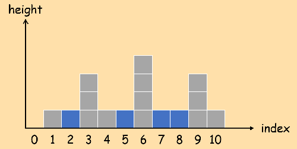

## 42. 接雨水

给定 n 个非负整数表示每个宽度为 1 的柱子的高度图，计算按此排列的柱子，下雨之后能接多少雨水。

**示例：**

``` text
输入: [0,1,0,2,1,0,1,3,2,1,2,1]
输出: 6
```

**示意图：**



上图对应的输入数组为：\[0, 1, 0, 3, 1, 0, 4, 0, 0, 3, 1\]。盛水部分的面积为蓝色部分，总面积为12。

原题传送门：[https://leetcode-cn.com/problems/trapping-rain-water](https://leetcode-cn.com/problems/trapping-rain-water)
