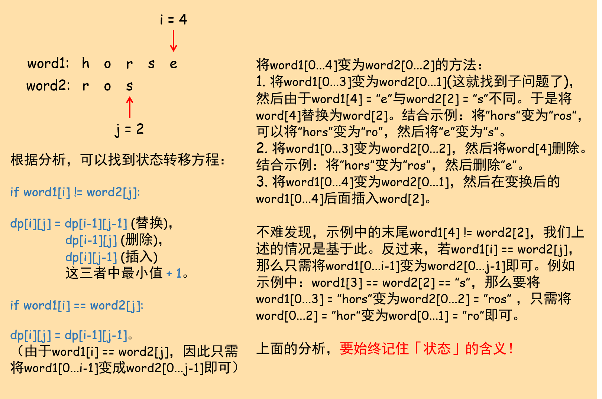

给你两个单词`word1`和`word2`，请你计算出将`word1`转换成`word2`所使用的最少操作数 。

你可以对一个单词进行如下三种操作：

+ 插入一个字符
+ 删除一个字符
+ 替换一个字符

示例 1：

``` text
输入：word1 = "horse", word2 = "ros"
输出：3
解释：
horse -> rorse (将 'h' 替换为 'r')
rorse -> rose (删除 'r')
rose -> ros (删除 'e')
```

示例2：

``` text
输入：word1 = "intention", word2 = "execution"
输出：5
解释：
intention -> inention (删除 't')
inention -> enention (将 'i' 替换为 'e')
enention -> exention (将 'n' 替换为 'x')
exention -> exection (将 'n' 替换为 'c')
exection -> execution (插入 'u')
```

原题传送门：[https://leetcode-cn.com/problems/edit-distance](https://leetcode-cn.com/problems/edit-distance)

## 本题的点

初入动态规划就碰到这题，真是要了亲命了。

### 状态定义

本题是DP经典的题目之一，要求我们对「状态」的定义和含义极其明确。如果能非常清楚地定义状态，明确其含义，状态转移方程不是难点。

更蛋疼的是，本题状态的定义又是极其直接：`dp[i][j]`定义为将`word1[0...i-1]`变为`word2[0...j-1]`所需的最少操作次数。`dp[i][j]`的这个含义需要我们从头到尾都记住。

这个定义是如何想到的？很大程度上是经验，如「718. 最长重复子数组」（与「最长公共子串」是同一个题）所述，对于两个数组或字符串的DP问题，一般开始让两个指针`i`和`j`指向字符串/数组尾部，然后逐步前移，**减小问题的规模，寻找子问题**。

其实另一方面，很多的DP题都是根据题目所求直接进行定义。

### 状态转移方程

明确状态后，找状态转移方程的难度就降低了一半。

以题目给的示例1为例，我们让`i`和`j`分别指向`word1`和`word2`的末尾，然后寻找子问题和状态转移：



需要注意的是，与「718. 最长重复子数组」相似，我们的DP Table需要额外多加一行和一列（加在第一行和第一列前）来初始化。根据「状态」的定义及其含义，第一行应初始化为`[0, 1, 2, ..., word1.size()]`，第一列应初始化为`[0, 1, 2, ..., word2.size()]`。

### 参考代码

``` c++
class Solution {
private:
    int min(int a, int b){
        return a > b ? b : a;
    }
public:
    int minDistance(string word1, string word2) {
        int n1 = word1.size();
        int n2 = word2.size();
        vector<vector<int>> dp(n1 + 1, vector<int>(n2 + 1, 0));
		// dp数组初始化
        for(int i = 0; i <= n1; i++)
            dp[i][0] = i;
        for(int i = 0; i <= n2; i++)
            dp[0][i] = i;
		// 开始填表
        for(int i = 1; i <= n1; i++){
            for(int j = 1; j <= n2; j++){
                if(word1[i - 1] != word2[j - 1]){
                    int substitute = dp[i - 1][j - 1] + 1;
                    int insert = dp[i][j - 1] + 1;
                    int del = dp[i - 1][j] + 1;
                    dp[i][j] = min(substitute, min(insert, del));
                }
                else
                    dp[i][j] = dp[i - 1][j - 1];
            }
        }
        return dp[n1][n2];
    }
};
```
