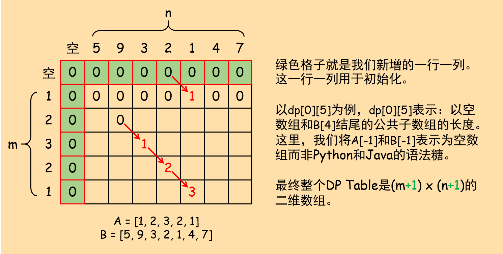
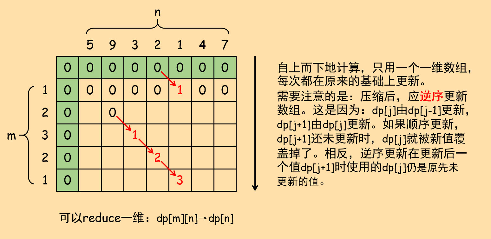

## 718. 最长重复子数组

给两个整数数组`A`和`B`，返回两个数组中公共的、长度最长的子数组的长度。

示例：

``` text
输入：
A: [1, 2, 3, 2, 1]
B: [3, 2, 1, 4, 7]
输出：3
解释：长度最长的公共子数组是 [3, 2, 1] 。
```

提示：

+ 1 <= len(A), len(B) <= 1000
+ 0 <= A\[i\], B\[i\] < 100

原题传送门：[https://leetcode-cn.com/problems/maximum-length-of-repeated-subarray](https://leetcode-cn.com/problems/maximum-length-of-repeated-subarray)

## 关键点

1. 状态定义
2. 状态转移方程
3. 最终的结果是什么

## 问题分析

### 状态与状态转移

本题与经典问题「最长公共子串」几乎没有区别。先来说DP状态定义和状态转移方程的结论：

状态定义：定义`dp[i][j]`为以`A[i]`和`B[j]`为结尾的公共子数组的长度。注意！我们这里的定义是「公共子数组」而非子数组。

状态转移方程：

+ if `A[i] != B[j]`，`dp[i][j] = 0`
+ if `A[i] == B[j]`，`dp[i][j] = dp[i-1][j-1] + 1`

这样定义状态的原因：

1. DP的本质仍然是暴力穷举，比较巧妙的是DP在穷举的过程中充分利用了已经计算过的历史信息（也就是DP常说的子问题的解）。若原问题所求的最长公共子数组存在，则它一定是以A、B的某个相同元素结尾。因此要做的就是遍历**分别以A、B某两个元素结尾的所有可能的情况**，取其中最长即可。
2. 两个经验：
   1. 对于这种两个数组、字符串的动态规划问题，经验上的结论就是将状态定义为以`i`和`j`结尾的xxx。
   2. 在分析问题时，通常都会让两个指针`i`和`j`指向字符串或数组的结尾，然后逐步向前。这样做是为了**减小问题的规模，找到子问题**。采用相同经验和做法的另一经典题目：72. 编辑距离。

在实现上，有一个经常使用的技巧：设`n_a = A.size()`，`n_b = B.size()`，我们在上述分析中的DP Table上，额外在第一行和第一列前增加一行一列（与其下标保持一致，我们称其为第0行第0列），因此`dp`为`n_a + 1`行`n_b + 1`列的二维数组。新增的第一行和第一列用于初始化。这样做可以使我们的初始化逻辑变简单，且保证后面填表时的逻辑是一致的。结合本题具体来说：对第0行，`dp[0][i]`的含义是以`A[-1]`(这意味着**空数组**)和`B[i - 1]`结尾的公共子数组的长度。同理，第0列`dp[i][0]`的含义是以`A[i - 1]`和`B[-1]`(意味着**空数组**)结尾的公共子数组的长度。因此，本问题中，第0行第0列所有元素全部为零。注意，这里的`A[-1]`和`B[-1]`是指空数组，并非Python或Java中的语法糖。



由于DP Table多加了一行一列，因此`dp[i][j]`的含义要稍加修改：以`A[i - 1]`和`B[j - 1]`为结尾的公共子数组的长度。接下来的只需要根据状态转移和条件敲代码即可。

### 参考代码

``` c++
class Solution {
private:
    int max(int a, int b){
        return a > b ? a : b;
    }
public:
    int findLength(vector<int>& A, vector<int>& B) {
        int n_a = A.size();
        int n_b = B.size();
        int result = 0;
        vector<vector<int>> dp(n_a + 1, vector<int>(n_b + 1, 0));
        for(int i = 1; i <= n_a; i++){
            for(int j = 1; j <= n_b; j++){
                if(A[i - 1] == B[j - 1]){
                    dp[i][j] = dp[i - 1][j - 1] + 1;
                    result = max(result, dp[i][j]);
                }
                else
                    dp[i][j] = 0;
            }
        }
        return result;
    }
};
```

## DP Table压缩

这一步是观察并找出DP Table的更新规律，去除存储中的冗余。在这一步中，我们的关注点是DP Table而不再是问题本身，根据DP Table的特性进行空间压缩。



不难看出，每次的更新都是「斜对角」式的更新，且每行更新**只依赖于相邻的上一行**的结果，因此完全可以将DP Table压缩成一个一维数组。需要注意的是压缩后必须逆序更新，避免覆盖造成的错误（见上图）。

### 参考代码

``` c++
class Solution {
private:
    int max(int a, int b){
        return a > b ? a : b;
    }
public:
    int findLength(vector<int>& A, vector<int>& B) {
        int n_a = A.size();
        int n_b = B.size();
        int result = 0;
        vector<int> dp(n_b + 1, 0);
        for(int i = 0; i < n_a; i++){
            for(int j = n_b; j > 0; j--){
                if(A[i] == B[j - 1]){
                    dp[j] = dp[j - 1] + 1;
                    result = max(result, dp[j]);
                }
                else
                    dp[j] = 0;
            }
        }
        return result;
    }
};
```
