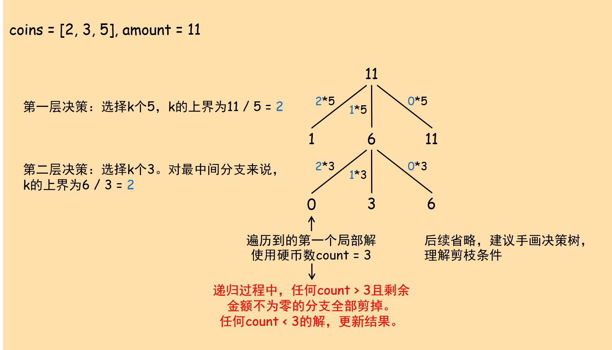

## 322. 零钱兑换

给定不同面额的硬币`coins`和一个总金额`amount`。编写一个函数来计算可以凑成总金额所需的最少的硬币个数。如果没有任何一种硬币组合能组成总金额，返回-1。

示例1：

``` text
输入：coins = [1, 2, 5], amount = 11
输出：3
解释：11 = 5 + 5 + 1
```

示例2：

``` text
输入：coins = [2], amount = 3
输出：-1
```

说明：每种硬币的数量是无限的。

原题传送门：[https://leetcode-cn.com/problems/coin-change](https://leetcode-cn.com/problems/coin-change)

## 广义0-1决策模型（贪心 + DFS回溯 + 剪枝）



### 参考代码

``` c++
class Solution {
private:
    int result;
    int min(int a, int b){
        return a > b ? b : a;
    }
public:
    void solver(vector<int> &coins, int last, int end, int used_count){
        if(last == 0){
            result = min(result, used_count);
            return;
        }
        if(end == -1)
            return;
        for(int k = last / coins[end]; k >= 0 && used_count + k < result; k--){
            solver(coins, last - k * coins[end], end - 1, used_count + k);
        }
    }
    int coinChange(vector<int>& coins, int amount) {
        result = INT_MAX;
        sort(coins.begin(), coins.end());   // 升序排序
        solver(coins, amount, coins.size() - 1, 0);
        return result == INT_MAX ? -1 : result;
    }
};
```
