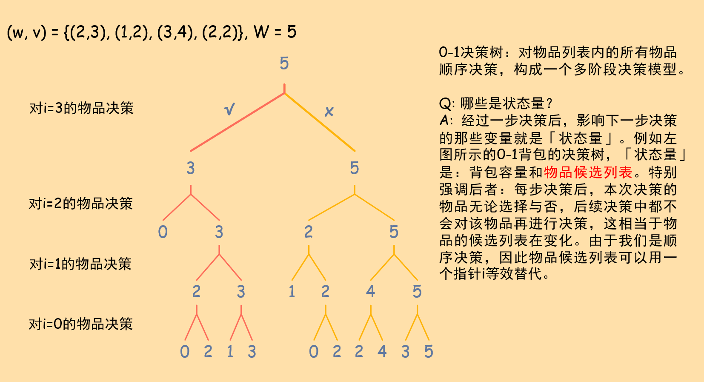
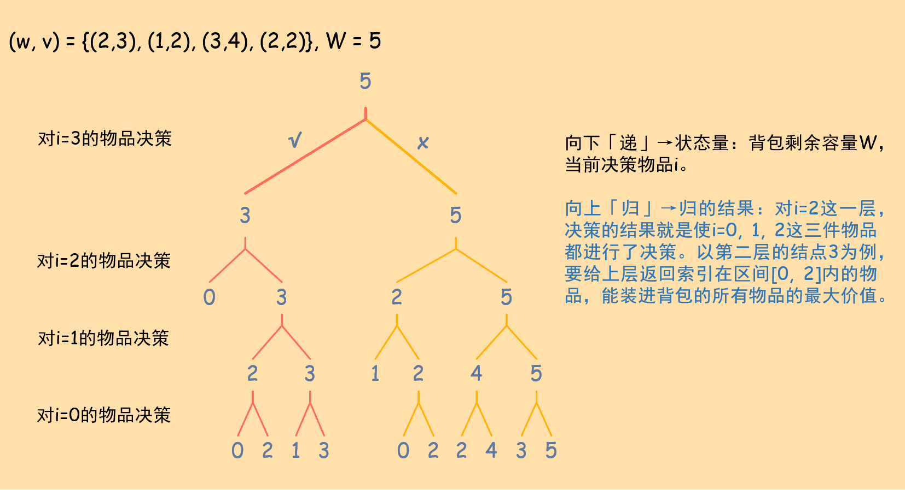
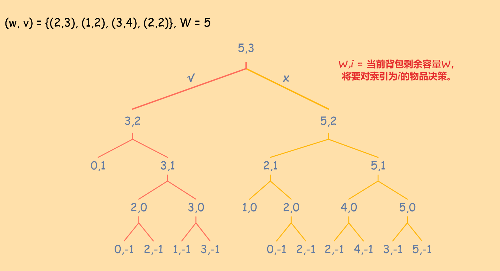

## 前言与本篇重点

对绝大多数同学来说，《背包九讲》是入门DP的不二选择。但我想一定存在像我一样非要做追本溯源这种"无用又无聊"的事情的人（当然我本人是痛并快乐着）。经过个人粗浅的探索和前辈的无私交流和帮助，对背包问题有了一些更具体清晰的系统认知（个人姑且认为是一种比较不错的方法论），遂将整个思考浓缩于本文，希望能抛砖引玉。

本篇特别侧重：

+ 「决策问题」与「背包问题」的关系（「问题」之间的关系）。
+ 「递归决策树」与「背包DP」的关系（问题之间有联系，那么「解决方法」上应该具备一定的共通性）。
+ 背包状态定义的背后思考和支撑：决策树。

熟悉《算法导论》的同学可能会发现，这些内容与算导15章动态规划相似。我们在这里的工作是：专注于经典的背包类问题，着重于打通「决策树」和「背包DP」之间的联系，理解DP方法中为何这样定义「状态」，知其所以然。同时也希望尽可能地为看算导看得似懂非懂的同学起到一点拨云见日的作用。

希望本文能尽可能地面向各种情况的CSer。特别地，若读者是以下一种或多种情况，可能会更加受益：

+ 希望了解背包问题的来龙去脉，特别是「状态定义」背后的思考和原因。
+ 不触碰到本质就不会做题的同学（本人就是典型的这种体质。我为这种体质带盐！）。
+ 能够理解递归、回溯法，但理解DP困难的同学。

我们同时希望能照顾到初心者，尽最大可能避免劝退情况的发生。不过还是希望读者能有一定基础：

+ 理解「树」这一基本的数据结构。
+ 理解递归、回溯法。
+ 对DP Table有初步的印象（非强制）。

基础内容是我们全篇的根基，希望尚不熟练的读者先行巩固。可以参考本仓库的相关内容（推荐看看回溯法）。

## 01背包

### 问题描述

有$n$个重量和价值分别为$w_i$, $v_i$的物品和一个最大容量为$W$的背包。寻求一种物品挑选方案，使装入背包的所有物品总价值最大。求最大价值。

样例（直接取自ACM白书）：

---

输入：n = 4, (w, v) = {(2, 3), (1, 2), (3, 4), (2, 2)}, W = 5

输出：7
解释：选择索引为0, 1, 3的物品

---

### 解决方法与决策树

我们不妨抛开各种算法，先来看怎么解决这个问题。最简单的方法就是暴力尝试所有可能：每次拿起一个物品，看其重量是否超过背包最大容纳量。如果超过容量就换下一个物品。如果不超过容量，可以选择放进去或不放进去（如果物品重量很大但价值很低，那我们肯定不会选择它）。然后看下一件物品，进行同样的操作。在整个过程中，我们计算背包内物品总价值，并始终记录一个最大值。当我们尝试完所有可能的情况后，记录的最大值即为所求。这个方案可以使用递归实现。由于递归是一种「自顶向下」的思考方式，我们改为从`(w, v)`数组（物品候选列表）的最后一个物品`i = (w, v).size() - 1`开始决策。当然也可以从`i = 0`，只需进行微小的变化即可。

``` c++
int solution(vector<pair<int, int>> &items, int cap, int i){
	/* items为物品列表，每个物品的pair表示(weight, value)，cap为背包剩余容量，i为当前选择物品的索引
		我们希望函数返回：容量为cap的背包带走物品的最大总价值 */

		// 物品都选过了 或 背包容量为零，结束递归
		// 从最后一个物品开始决策：i == -1结束。从第一个物品开始决策：i == items.size()结束。
		if(cap == 0 || i == -1)
			return 0;
		
		// 对于当前候选物品items[i]，可以选也可以不选。
		// 从最后一个物品开始决策，下一个物品为i - 1。从第一个物品开始决策，下一个物品为i + 1。
		int discard = solution(items, cap, i - 1);	// 不选
		int select = cap >= items[i].first ? solution(items, cap - items[i].first, i - 1) + items[i].second : 0;	// 不超重才能选

		return max(discard, select);
}

int main(){
	vector<pair<int, int>> items(4);
	init_item_list(items);		// 物品列表初始化
	int cap = 5;	// 背包容量
	int result = solution(items, cap, items.size() - 1);	// 从最后一个物品开始
	printf("%d", result);
	return 0;
}
```

上述过程本质上是一棵「0-1决策树」：每步决策针对候选列表中的一个物品，有两种选择：选或不选。



我们分别细化一下「递」和「归」两个过程：

+ 递的过程：分阶段决策过程。背包容量剩余`W`时，对当前物品`i`进行决策。
+ 归的结果：对确定的某层递归`f(W, i)`，在背包容量W下，我们**已经对索引在\[0, i\]的所有物品进行了决策**，结果就是求得并返回W容量的背包能容纳物品的最大价值。

我们对这两个过程的功能进行一个抽象：

+ 在递的过程中，找到**影响下一步决策的变量**，这些变量就是与「状态转移方程」直接相关的「状态量」。如果将状态转移写成函数的形式，这些「状态量」就是函数的自变量。例如`f(W, i)`的状态量就是`W, i`。通过这种自上而下的决策，我们可以缩小问题规模，找到子问题，这样我们就可以初步找到状态转移方程的感觉了。
+ 在归的过程中，结合递过程进行的决策，明确归过程得到的结果。很多情况下，返回结果的含义直接定义为问题所求。

最终，联合递的「状态量」、归的「结果」的意义，定义状态的含义。

上述递归的求解顺序是「自顶向下」的，并且我们的思考过程也同样是「自顶向下」的。动态规划方法则是将执行顺序反过来，「自底向上」地进行求解。因此「状态量」和「状态含义」不变，只是我们这次从规模最小的base case出发，逐渐扩大问题规模。由于较大规模的问题依赖于更小规模问题的结果，而小规模问题先被求解，因此最终就完成了整个问题的递推。

具体实施上，由于大问题依赖于小问题的结果，因此我们需要开辟一个数组或哈希表来存储小问题的结果。数组/哈希表的索引就是「状态量」，存储的值就是在「状态量」下的问题的结果。

回到0-1背包问题上，我们将上述理论具体化，付诸实践。根据0-1背包的分段决策模型（0-1决策树），我们尝试使用一图流来讲清这个问题：



特别强调：

+ 每次我们都是对不同的物品进行决策。本次决策的物品，在后续过程中就不会再进行决策。因此，物品候选列表必然要作为状态量中的一部分。由于我们逆序地在所有物品中逐个进行决策，因此可以等效地用一个指针替代。
+ 着重关注一下上图中「归的结果」的解释，这是我们后面使用动态规划时「状态定义」的直接根据。

一般在我们的手稿上，为了简洁且便于自己理解，会将决策写进状态量中，用类似于函数的形式明确状态量：



### 我们为什么会puzzle于状态定义？

经过上面的讨论，尤其是我们明确了诸如「状态量」的这些概念后，会发现其实很多解答中的「状态定义」实际上是「状态量」经过决策后的结果，也就是根据「归的结果」来定义状态的含义。如果直接对着结果学习，这叫倒果为因，从逻辑上讲我们不puzzle才比较奇怪。

### 白书中的决策顺序与本篇相反

本篇中，我们的自顶向下过程是对给定的物品列表（数组）逆序决策，而白书是对数组正序决策。顺序的更改是源于我的个人习惯：既然已经自顶向下，那不妨就倒着遍历数组元素。根据上述方法，我们可以写出白书正序决策下的「状态定义」（提示：状态定义是根据「归的结果」得来的）。

## 完全背包

## 参考资料

理论与方法论：

+ 背包九讲：入门。
+ 挑战程序设计竞赛（ACM白书）。
+ 算法导论：更偏向于一般DP的方法论，初期啃起来可能有点累，也不容易发挥最大效果。

习题：

+ 背包九讲：入门习题。
+ 算法竞赛入门经典（ACM紫书）：难度较大，后期精进使用。
