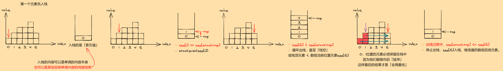
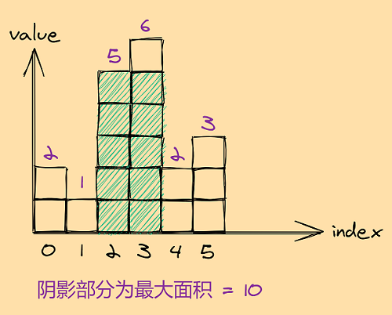
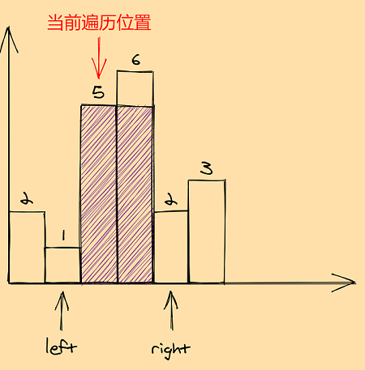
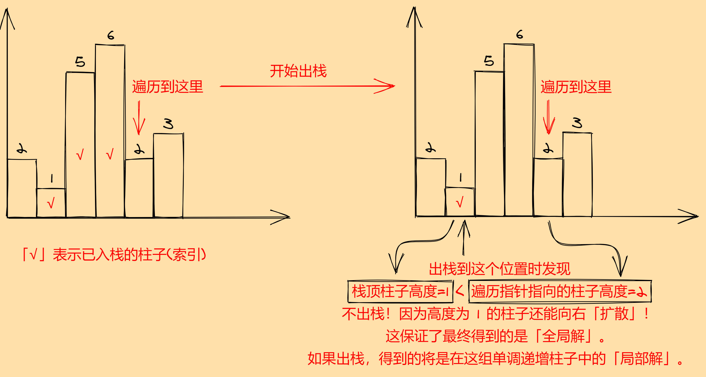

## 单调栈

「单调栈」是「栈」的一个特殊应用，要求栈中的元素直接或间接地「非严格单调」（即单调不减或单调不增，视具体问题决定），并且出入栈操作有特殊的限制条件。

具体来说，以单调不减为例，单调栈的标准操作（模板）是：

1. 第一个元素先入栈。
2. 遍历数组其余元素，如果：

+ 数组当前位置元素 >= 栈顶元素，入栈。
+ 数组当前位置元素 < 栈顶元素，单调栈中的元素循环出栈，直到「栈空」或「**栈顶元素 < 数组当前位置元素**」，停止出栈。



这里要重点关注单调栈出栈的终止条件：「**栈顶元素小于数组当前位置元素**」。这个条件保证了应用单调栈解决的问题可以得到**全局最优解**，否则将是**局部最优**。看下面的例题来具体理解这一点。

## 典型应用：84. 柱状图中最大矩形

给定 n 个非负整数，用来表示柱状图中各个柱子的高度。每个柱子彼此相邻，且宽度为1。求在该柱状图中，能够勾勒出来的矩形的最大面积。

**示例：**

``` text
输入: [2, 1, 5, 6, 2, 3]
输出: 10
```

**示意图：**



图中阴影部分为所能勾勒出的最大矩形面积，其面积为 10 个单位。

原题传送门：[https://leetcode-cn.com/problems/largest-rectangle-in-histogram](https://leetcode-cn.com/problems/largest-rectangle-in-histogram)

### 分析

本题容易想到的一个思路是：遍历数组`histogram`中的每个柱子。对于当前遍历位置的柱子`histogram[i]`，找到其左侧和右侧「第一个高度小于`histogram[i]`」的柱子的位置`left`和`right`，那么当前柱子高度`histogram[i]`就只能「扩散」到`left + 1`和`right - 1`的位置。



这个方法简单暴力，但行之有效。不难分析，时间复杂度为$O(N^2)$，空间复杂度$O(1)$。

上述思路最大的问题在于：每遍历一个柱子都需要找其左侧和右侧第一个比他小的柱子，需要二重循环，时间复杂度比较高。因此我们考虑从这个找左右第一小柱子的内层循环着手，思考优化方案。

观察遍历的过程，其实可以发现：我们在遍历过程中的一些历史信息可以利用，例如还是上面的那幅图：


左侧`left`的位置在一种特定情况下非常好找：当前柱子比前一根柱子严格大，就像上图那样。我们甚至可以贪心一点，更进一步：如果遍历时有一组柱子单调递增，那么这组柱子中，某根柱子`histogram[i]`的前一根柱子`histogram[i-1]`就必然是`histogram[i]`能扩散到的左边界`left`。那么我们就可以思考，是否可以将整个问题分解为若干组这样的特定情况？答案比较显然：我们总可以将数组中的所有柱子「划分」为若干组，每组内柱子的高度单调递增。

到这里，我们得到了一个似乎可行的思路，但还需要考虑一个问题：相邻两根柱子高度相同的情况？如果两根柱子高度相同，那他们所「扩散」所得矩形面积必然相同，这一点应该不难想到。

好了，到此为止，答案几乎呼之欲出：仅一个单调增的特性就可以直接睡服我们使用「单调栈」。熟悉单调栈的同学甚至可以在我们分析到一半的时候就想到单调栈了。接下来的要做的，就是对着「单调栈」的操作条件，像写数学公式一样码代码了。

最后，来看一个比较重要的东西。结合本题，自己举一个适当的例子，来理解「单调栈」出栈时的一个极为重要的条件：「**栈顶元素小于数组当前位置元素**」。该条件直接确保我们得到的解一定是「**全局解**」而非「局部解」。



### 参考代码

``` c++
class Solution {
private:
    vector<int> idx_stack;
    int max(int a, int b){
        return a>b?a:b;
    }
public:
    int largestRectangleArea(vector<int>& heights) {
        if(heights.empty())
            return 0;
        int max_area = 0;
        idx_stack.push_back(0);
        for(int i = 1; i < heights.size(); i++){
            while(!idx_stack.empty() && heights[i] < heights[idx_stack.back()]){
                int pos = idx_stack.back();
                idx_stack.pop_back();
                // 栈顶元素 = 左边第一个比当前计算面积的柱子低的柱子的位置
                if(!idx_stack.empty())
                    max_area = max(max_area, heights[pos] * (i - idx_stack.back() - 1));
                else
                    max_area = max(max_area, heights[pos] * i);
            }
            idx_stack.push_back(i);
        }
        // 循环结束后，最后一组柱子还没有计算
        while(!idx_stack.empty()){
            int pos = idx_stack.back();
            idx_stack.pop_back();
            if(!idx_stack.empty())
                max_area = max(max_area, heights[pos] * (heights.size() - idx_stack.back() - 1));
            else
                max_area = max(max_area, heights[pos] * heights.size());
        }
        return max_area;
    }
};
```
