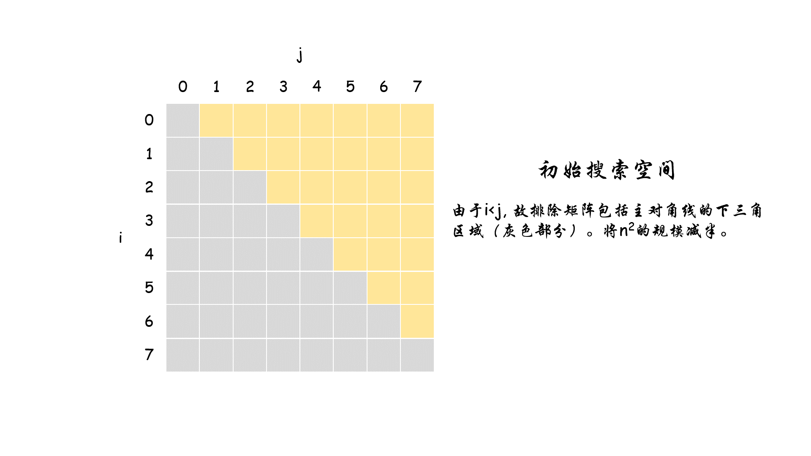

## 「搜索」问题可用的方法

1. 哈希表：借助哈希函数和冲突处理策略，将可哈希的对象作为「索引」(key)，在平均O(1)的时间复杂度下查找「key」对应的「value」。
2. 二分查找：「有序」性质的查找问题。利用「有序」的性质，每次「折半」都将当前「搜索空间」规模减半。
3. 双指针：重点在于选择合适的策略。根据策略，指针每次的移动都尽可能减小「搜索空间」的规模。

## 缩小「搜索空间」的规模

### 双指针的策略

例题：167. 两数之和 II - 输入有序数组

给定一个已按照升序排列 的有序数组，找到两个数使得它们相加之和等于目标数。

函数应该返回这两个下标值 index1 和 index2，其中 **index1 必须小于 index2**。

说明:

1. 返回的下标值（index1 和 index2）不是从零开始的。
2. 你可以假设每个输入只对应唯一的答案，而且你不可以重复使用相同的元素。

示例:

``` text
输入: numbers = [2, 7, 11, 15], target = 9
输出: [1,2]
解释: 2 与 7 之和等于目标数 9 。因此 index1 = 1, index2 = 2 。
```

原题传送门：[https://leetcode-cn.com/problems/two-sum-ii-input-array-is-sorted](https://leetcode-cn.com/problems/two-sum-ii-input-array-is-sorted)

双指针常用的一个搜索策略：



### 参考代码

``` cpp
class Solution {
public:
    vector<int> twoSum(vector<int>& numbers, int target) {
        int i = 0;
        int j = numbers.size() - 1;
        while(i < j){
            if(numbers[i] + numbers[j] == target)
                return vector<int>({i + 1, j + 1});
            else if(numbers[i] + numbers[j] > target)
                j--;
            else
                i++;
        }
        return vector<int>();
    }
};
```

## 相同类型的题目

[leetcode 11. 盛水最多的容器][盛水最多的容器]  
[剑指offer 04. 二维数组中的查找][二维数组查找]

[盛水最多的容器]:https://leetcode-cn.com/problems/container-with-most-water/
[二维数组查找]: https://leetcode-cn.com/problems/er-wei-shu-zu-zhong-de-cha-zhao-lcof/