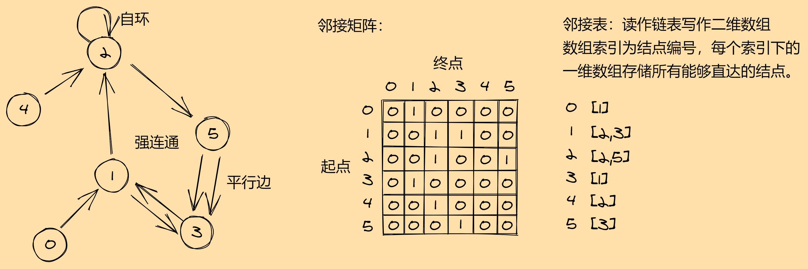

### Notion: HardLink path

leetcode/递归与优化/备忘录/M-面试题04.01.结点间通路.md
leetcode/BFS & DFS/M-面试题04.01.结点间通路.md

## 面试题04.01. 节点间通路

给定有向图，设计一个算法，找出两个节点之间是否存在一条路径。

示例1:

``` text
输入：n = 3, graph = [[0, 1], [0, 2], [1, 2], [1, 2]], start = 0, target = 2

输出：true
```

示例2:

``` text
输入：n = 5, graph = [[0, 1], [0, 2], [0, 4], [0, 4], [0, 1], [1, 3], [1, 4], [1, 3], [2, 3], [3, 4]], start = 0, target = 4

输出：true
```

hint:

1. 节点数量n在\[0, 1e5\]范围内。
2. 节点编号大于等于0小于n。
3. 图中可能存在自环和平行边。

原题传送门：[https://leetcode-cn.com/problems/route-between-nodes-lcci](https://leetcode-cn.com/problems/route-between-nodes-lcci)

## 问题分析

表面上看似是「图」的问题，实际上本质仍是哈希表。

从结点a到结点b的路径有两种可能：

1. a可以直达b。
2. a经过一个或多个中间结点到达b。

情况1最简单，邻接矩阵可以直接判断。情况2是主要处理的情况，我们可以从a出发，先走到a能直达的中间结点c，判断c是否可以到达b。从这个分析容易看出，问题具备「状态转移」（递推关系式）：设函数`f(a, b)`判断是否存在从a到b的路径，则`f(a, b) = f(c, b)`，且c为a能直达的结点。自然我们想到使用递归求解。这种方法实际上就是「深度优先遍历」(DFS)。

本题的坑：

1. 最大的一个坑：「邻接矩阵」存在极端情况：结点数量大，但结点间的连接稀疏，即邻接矩阵是一个非常大的稀疏矩阵。如果此时仍用邻接矩阵，则可能运行超时（而非超过空间限制。这会让你认为代码的逻辑可能有问题（比如会认为出现了死循环），这是最坑的）。这要求我们采用更紧致的图的表示法：「邻接表」。「邻接表」表面上定义为「链表」，但实际中我们可以用「二维数组」或是「哈希数组」（数组中的元素是哈希表）实现。
2. 图中可能有「环」：「自环」或构成「强连通」都有可能，因此必须避免环路带来的无限递归。解决这个问题的方法就是「备忘录」：在备忘录中记录已访问过的结点，递归过程中，若某节点已访问，则跳过该结点。

作图分析：



## 参考代码

``` c++
class Solution {
    vector<vector<int>> adjcent;
    vector<bool> visited;
public:
    bool solver(int start, int target){
        if(start == target)
            return true;
        visited[start] = true;
        bool result = false;
        for(int i = 0; i < adjcent[start].size(); i++){
            if(visited[adjcent[start][i]])
                continue;
            result = result || solver(adjcent[start][i], target);
        }
        return result;
    }
    bool findWhetherExistsPath(int n, vector<vector<int>>& graph, int start, int target) {
        adjcent.resize(n);
        visited.resize(n, false);
        for(int i = 0; i < graph.size(); i++){
            adjcent[graph[i][0]].push_back(graph[i][1]);
        }
        return solver(start, target);
    }
};
```
