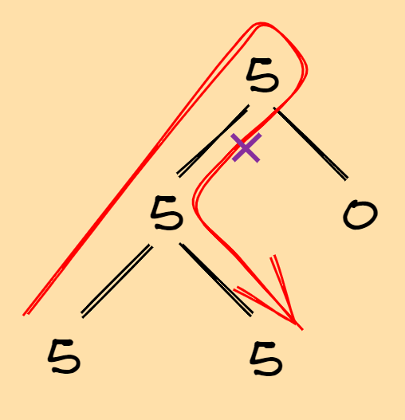
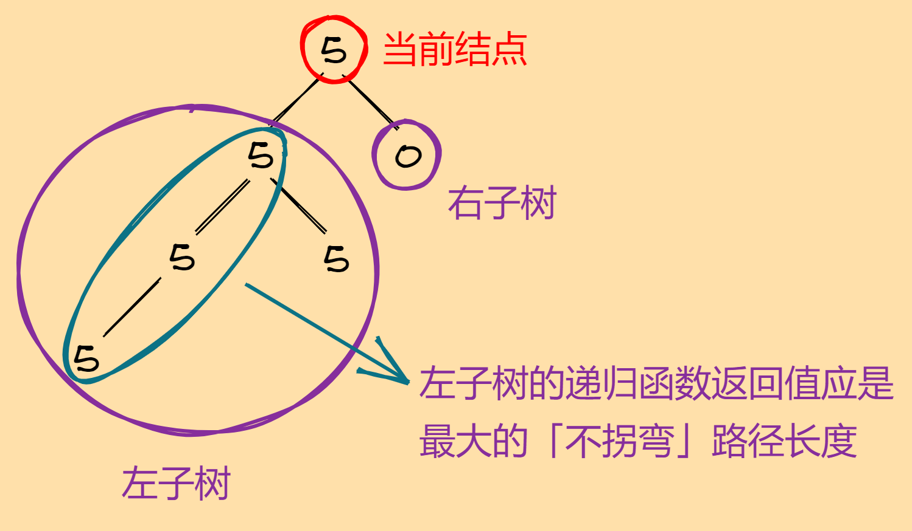

## 687. 最长同值路径

给定一个二叉树，找到最长的路径，这个路径中的每个节点具有相同值。 这条路径可以经过也可以不经过根节点。

注意：两个节点之间的路径长度由它们之间的边数表示。

示例1:

``` text
input:
              5
             / \
           4    5
          / \     \
        1    1    5
output: 2
```

示例2:

``` text
input:
              1
             / \
           4    5
          / \     \
        4    4    5
output: 2
```

原题传送门：[https://leetcode-cn.com/problems/longest-univalue-path](https://leetcode-cn.com/problems/longest-univalue-path)

## 分析

问题分析：二叉树问题绝大多数情况都有递归这一条路，因为非叶子结点的左右子树均是非空二叉树。根据题意来说，本题的同值路径可以借由根结点「拐弯」，但「路径」的前提是不能经过重复的「边」。

一般来说，在递归分析中，我们将任意的二叉树视为以下结构：

``` text
        根结点
         /   \
   左子树  右子树
```

一个比较平缓的思考策略是：在问题上手分析过程、细节处理中，我们可以具体化一些简单但不失一般性的实例，然后对照实例，逐渐将问题抽象为上面的结构。

回到本题，我们可以对照着示例2：

``` text
input:
              1
             / \
           4    5
          / \     \
        4    4    5
output: 2
```

可以考虑第二层的结点「4」，根据我们在「递归的一点思考」中的讨论，「后面」是处理完的部分，也就是说左右子树的「最长同值路径」已经求得。那么针对当前结点的情况，可以有以下几点思考：

1. 拿到当前结点，我们将左右子树视作已经处理完的部分，也就是说左右子树的「最长同值路径」已经求得。接下来要做的就是试探左右子树的根结点的值是否与当前结点的值相等。至于左右子树递归的返回值是什么，似乎是存疑的，主要因为「路径」的概念限制不能经过重复的边：



那么现在先暂时搁置返回值这件事。正如「递归的一点思考」中的讨论，根据我们分析根结点的情况，**需要什么就让函数返回什么**。
2. if 当前结点的值 == 左/右子树根结点的值，说明当前结点可以与左/右子树的根结点可以连成一个「同值路径」。例如示例2第二层的第一个结点「4」，左右子树的根结点的值都与该结点的值相等，因此可以构成一个借由当前结点「拐弯」的「同值路径」。
3. 顺着2的思路，能够考虑到：将当前结点的值与左右子树的根结点的值分别比较，如果相等，那么对应的同值路径长度加一。此时返回值自然就明确了：我们需要函数返回左右子树的「同值路径」。注意，我们这里的用词是「同值路径」而非「最长同值路径」，有两个原因：
    1. 左/右子树具体的「最长同值路径」尚不清楚，有可能不与子树的根结点相连。
    2. 思考当前结点：如果当前结点与左右子树根结点的值均相等（例如示例2第二层的结点「4」），则说明存在一条从当前结点拐弯的「同值路径」。由于「路径」的概念限制我们不能经过相同的边，那么「归」时给上层递归的返回值应是「左同值路径」和「右同值路径」的最大值。
4. if 当前结点的值 != 左/右子树根结点的值，根据上面的分析，对应子树「同值路径」归零。
一张图展示整个思考过程：


## 参考代码

``` c++
class Solution {
public:
    int result;
    Solution():result(0){}
    int max(int a, int b){
        return a>b?a:b;
    }
    int longestUnivaluePath(TreeNode* root) {
        solver(root);
        return result;
    }
    int solver(TreeNode *root){
        if(root == nullptr) return 0;
        int left = solver(root -> left), right = solver(root -> right);
        if(root -> left){
            if(root -> val == root -> left -> val) left += 1;
            else left = 0;
        }
        if(root -> right){
            if(root -> val == root -> right -> val) right += 1;
            else right = 0;
        }
        result = max(result, left + right);
        return max(left, right);
    }
    /* 递归（分治法）理解不成熟导致的错解
    问题出现在Q1 ~ Q3，是对分治法理解不成熟导致的：递归是无条件的，是分治法中「分」的过程，而路径长度是否加1则是「治」的过程。
    int solver(TreeNode *root){
        if(root == nullptr) return 0;
        int left = 0, right = 0;    // Q1，这里应该进行递归调用，是「分」的过程。
        if(root -> left){
            if(root -> val == root -> left -> val)
                left = solver(root -> left) + 1;    // Q2，递归不该在这里进行，这里是治的过程。下同。
            else left = 0;
        }
        if(root -> right){
            if(root -> val == root -> right -> val)
                right = solver(root -> right) + 1;    // Q3
            else right = 0;
        }
        result = max(result, left + right);
        return max(left, right);
    }
    */
};
```

## 一模一样的题：124. 二叉树中的最大路径和
